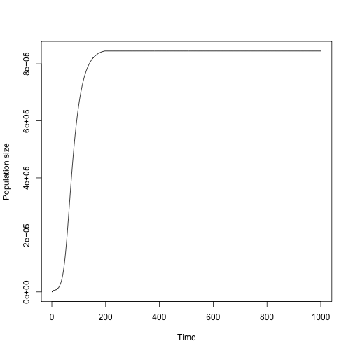
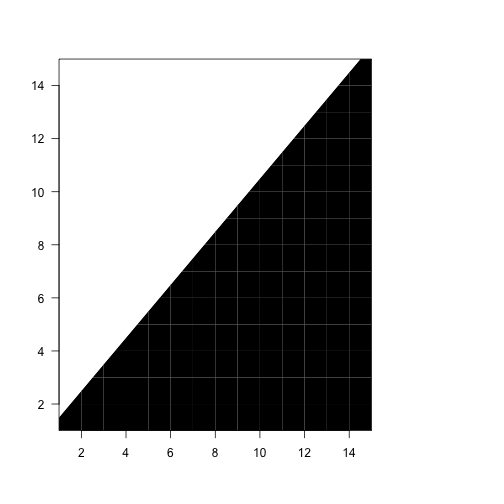
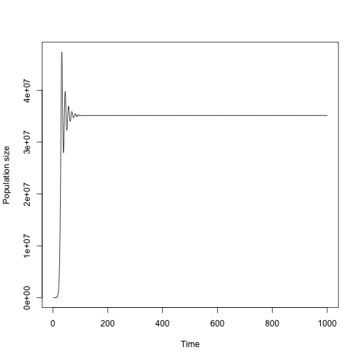
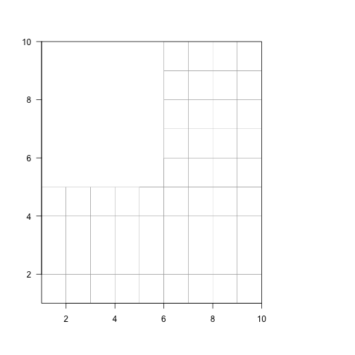

  <p style="text-indent: 20px">In this vignette, we will use the `cypa_data` dataset to illustrate pairwise invasibility analysis using package `adapt3`. We will conduct two such analyses, the first focused on testing variants created by altering matrix elements, and the second focused on testing variants created through alterations to vital rate models used in function-based MPM development.</p>
  
  <p style="text-indent: 20px">To reduce vignette size, we have prevented some statements from running if they produce long stretches of output. Examples include most `summary()` calls. In these cases, we include hashtagged versions of these calls, and we encourage the user to run these statements without hashtags.</p>
  
  <p style="text-indent: 20px">This vignette is only a sample analysis. Detailed information and instructions on using `adapt3` will be made available over time. Please check available resources on <a href = "http://www.revolutionarydemography.com/projects.html">the projects page</a> of the `{r}evolutionary demography` website.</p>
  
### Organism and population 
  
  <p style="text-indent: 20px">*Cypripedium parviflorum* (family Orchidaceae) is a long-lived herbaceous perennial, native to North America and particularly common near the Great Lakes. It typically lives in wet, calcareous wetlands on the edges of woodlands [@shefferson_estimating_2001]. Individuals begin life as dust seeds, which may or may not germinate the year following production. Germination leads to the protocorm stage, a life history stage in which the individual grows underground in a non-photosynthetic, mycoheterotrophic state [@rasmussen_orchids_1995]. They may live in this state for several years prior to becoming a seedling, at which point they may or may not sprout. Maturity involves the production of flowering sprouts, each with several leaves and typically only a single flower, although an individual may produce mostly non-flowering sprouts. Most individuals produce only a single sprout, and vegetative dormancy is common and can occur for overa decade in a single individual [@shefferson_drivers_2018].</p>
  
  <p style="text-indent: 20px">Data for this study were collected from a population in northeastern Illinois, from 2004 to 2009 [@shefferson_predicting_2017]. Each year at the start of the flowering season, all individuals at the site were located, with previously identified individuals identified based on their previous locations, and new individuals recorded via an exhaustive survey. Plant characteristics including the number of sprouts, which sprouts were flowering vs. non-flowering, and the number of flowers per sprout, were recorded for every individual in every year.</p>
  
### DATASET PREPARATION
  
  <p style="text-indent: 20px">Package `adapt3` is built to take advantage of package `lefko3`, which offers a general language and architecture to build and analyze most kinds of matrix projection models, including even discretized integral projection models [@shefferson_lefko3_2021]. To start, we will load both `lefko3` and `adapt3`, and also load the dataset that we will use for our two examples.</p>

``` r
library(lefko3)
library(adapt3)

data(cypa_data)
#summary(cypa_data)
```

  <p style="text-indent: 20px">This dataset includes information on 114 individuals arranged horizontally, by row. There are 26 variables, by column. The first two columns are variables giving identifying information about each individual, including the individual identity and the patch the individual is located in. This is followed by six sets of four columns, each named `Inf2XX`, `InfXX`, `VegXX`, and `PodXX`, where `XX` corresponds to the year of observation and with years organized consecutively. Thus, columns 3-6 refer to year 2004, columns 7-10 refer to year 2005, etc. This strictly repeating pattern allows us to manipulate the original dataset quickly and efficiently via `lefko3`.</p>
  
  <p style="text-indent: 20px">Per `lefko3` terminology, we will develop a stageframe that encapsulates our life history model by noting all of the relevant characteristics of each stage, as below.</p>

``` r
sizevector <- c(0, 0, 0, 0, 1, 2.5, 4.5, 8, 17.5)
stagevector <- c("SD", "P1", "SL", "D", "XSm", "Sm", "Md", "Lg", "XLg")
repvector <- c(0, 0, 0, 0, 1, 1, 1, 1, 1)
obsvector <- c(0, 0, 0, 0, 1, 1, 1, 1, 1)
matvector <- c(0, 0, 0, 1, 1, 1, 1, 1, 1)
immvector <- c(0, 1, 1, 0, 0, 0, 0, 0, 0)
propvector <- c(1, 0, 0, 0, 0, 0, 0, 0, 0)
indataset <- c(0, 0, 0, 1, 1, 1, 1, 1, 1)
binvec <- c(0, 0, 0, 0.5, 0.5, 1, 1, 2.5, 7)

cypframe_raw <- sf_create(sizes = sizevector, stagenames = stagevector,
  repstatus = repvector, obsstatus = obsvector, matstatus = matvector,
  propstatus = propvector, immstatus = immvector, indataset = indataset,
  binhalfwidth = binvec)
cypframe_raw
#>   stage size size_b size_c min_age max_age repstatus obsstatus propstatus immstatus matstatus indataset binhalfwidth_raw sizebin_min
#> 1    SD  0.0     NA     NA      NA      NA         0         0          1         0         0         0              0.0         0.0
#> 2    P1  0.0     NA     NA      NA      NA         0         0          0         1         0         0              0.0         0.0
#> 3    SL  0.0     NA     NA      NA      NA         0         0          0         1         0         0              0.0         0.0
#> 4     D  0.0     NA     NA      NA      NA         0         0          0         0         1         1              0.5        -0.5
#> 5   XSm  1.0     NA     NA      NA      NA         1         1          0         0         1         1              0.5         0.5
#> 6    Sm  2.5     NA     NA      NA      NA         1         1          0         0         1         1              1.0         1.5
#> 7    Md  4.5     NA     NA      NA      NA         1         1          0         0         1         1              1.0         3.5
#> 8    Lg  8.0     NA     NA      NA      NA         1         1          0         0         1         1              2.5         5.5
#> 9   XLg 17.5     NA     NA      NA      NA         1         1          0         0         1         1              7.0        10.5
#>   sizebin_max sizebin_center sizebin_width binhalfwidthb_raw sizebinb_min sizebinb_max sizebinb_center sizebinb_width binhalfwidthc_raw
#> 1         0.0            0.0             0                NA           NA           NA              NA             NA                NA
#> 2         0.0            0.0             0                NA           NA           NA              NA             NA                NA
#> 3         0.0            0.0             0                NA           NA           NA              NA             NA                NA
#> 4         0.5            0.0             1                NA           NA           NA              NA             NA                NA
#> 5         1.5            1.0             1                NA           NA           NA              NA             NA                NA
#> 6         3.5            2.5             2                NA           NA           NA              NA             NA                NA
#> 7         5.5            4.5             2                NA           NA           NA              NA             NA                NA
#> 8        10.5            8.0             5                NA           NA           NA              NA             NA                NA
#> 9        24.5           17.5            14                NA           NA           NA              NA             NA                NA
#>   sizebinc_min sizebinc_max sizebinc_center sizebinc_width group       comments
#> 1           NA           NA              NA             NA     0 No description
#> 2           NA           NA              NA             NA     0 No description
#> 3           NA           NA              NA             NA     0 No description
#> 4           NA           NA              NA             NA     0 No description
#> 5           NA           NA              NA             NA     0 No description
#> 6           NA           NA              NA             NA     0 No description
#> 7           NA           NA              NA             NA     0 No description
#> 8           NA           NA              NA             NA     0 No description
#> 9           NA           NA              NA             NA     0 No description
```

  <p style="text-indent: 20px">Next we will create our verticalized dataset, in which our horizontal dataset is restructured to have all data for each individual split into blocks of 3 consecutive monitoring occasions, as below. Note that, because we are using the `stageassign` argument, we can have `R` assign stages to each individual in each occasion. Note also our use of the `summary_hfv()` function, which provides specialized, useful output for this style of data frame.</p>

``` r
cypraw_v1 <- verticalize3(data = cypdata, noyears = 6, firstyear = 2004,
  patchidcol = "patch", individcol = "plantid", blocksize = 4,
  sizeacol = "Inf2.04", sizebcol = "Inf.04", sizeccol = "Veg.04",
  repstracol = "Inf.04", repstrbcol = "Inf2.04", fecacol = "Pod.04",
  stageassign = cypframe_raw, stagesize = "sizeadded", NAas0 = TRUE,
  NRasRep = TRUE)
#summary_hfv(cypraw_v1)
```

### Pairwise invasibility analysis focused on matrix element manipulation
  
  <p style="text-indent: 20px">Our first example will focus on running pairwise invasibility analyses in which matrix elements are manipulated to create our pairs of residents and mutants. To make this process easier, we will develop a relatively small, stage-based empirical MPM</p>
  
### Part 1. MPM preparation
  


``` r
cypsupp2r <- supplemental(stage3 = c("SD", "P1", "SL", "D", 
    "XSm", "Sm", "SD", "P1"),
  stage2 = c("SD", "SD", "P1", "SL", "SL", "SL", "rep",
    "rep"),
  eststage3 = c(NA, NA, NA, "D", "XSm", "Sm", NA, NA),
  eststage2 = c(NA, NA, NA, "XSm", "XSm", "XSm", NA, NA),
  givenrate = c(0.10, 0.40, 0.25, NA, NA, NA, NA, NA),
  multiplier = c(NA, NA, NA, NA, NA, NA, 1000, 1000),
  type =c(1, 1, 1, 1, 1, 1, 3, 3),
  stageframe = cypframe_raw, historical = FALSE)
#> Warning: NA values in argument multiplier will be treated as 1 values.

cypmatrix2r <- rlefko2(data = cypraw_v1, stageframe = cypframe_raw, 
  year = "all", patch = "all", stages = c("stage3", "stage2", "stage1"),
  size = c("size3added", "size2added"), supplement = cypsupp2r,
  yearcol = "year2", patchcol = "patchid", indivcol = "individ")
cypmean <- lmean(cypmatrix2r)

summary(cypmean)
#> 
#> This ahistorical lefkoMat object contains 4 matrices.
#> 
#> Each matrix is square with 9 rows and columns, and a total of 81 elements.
#> A total of 117 survival transitions were estimated, with 29.25 per matrix.
#> A total of 36 fecundity transitions were estimated, with 9 per matrix.
#> This lefkoMat object covers 1 population, 4 patches, and 0 time steps.
#> 
#> The dataset contains a total of 74 unique individuals and 320 unique transitions.
#> 
#> Survival probability sum check (each matrix represented by column in order):
#>          [,1]  [,2]  [,3]  [,4]
#> Min.    0.000 0.250 0.200 0.250
#> 1st Qu. 0.400 0.800 0.500 0.500
#> Median  0.868 0.824 0.900 0.842
#> Mean    0.643 0.776 0.743 0.720
#> 3rd Qu. 0.900 0.917 1.000 0.939
#> Max.    1.000 1.000 1.000 1.000
#> Warning: Some matrices include stages with survival probability greater than 1.0.
#> 
#> 
#> Stages without connections leading to the rest of the life cycle found in matrices: 1
```


``` r
cyp_start <- start_input(cypmean, stage2 = c("SD", "P1", "D"),
  value = c(1000, 200, 4))
cyp_start
#>   stage2 stage_id_2 stage1 stage_id_1 age2 row_num value
#> 1     SD          1     NA         NA   NA       1  1000
#> 2     P1          2     NA         NA   NA       2   200
#> 3      D          4     NA         NA   NA       4     4
```


``` r
c2d_4 <- density_input(cypmean, stage3 = c("P1", "P1"), stage2= c("SD", "rep"),
  style = 2, time_delay = 1, alpha = 0.005, beta = 0.000005, type = c(2, 2))
c2d_4
#>   stage3 stage2 stage1 age2 style alpha  beta time_delay type type_t12
#> 1     P1     SD     NA   NA     2 0.005 5e-06          1    2        1
#> 2     P1    XSm     NA   NA     2 0.005 5e-06          1    2        1
#> 3     P1     Sm     NA   NA     2 0.005 5e-06          1    2        1
#> 4     P1     Md     NA   NA     2 0.005 5e-06          1    2        1
#> 5     P1     Lg     NA   NA     2 0.005 5e-06          1    2        1
#> 6     P1    XLg     NA   NA     2 0.005 5e-06          1    2        1
```

A simple projection allows us to find a combination of density dependence and running time that produces a stable quasi-equilibrium

``` r
cyp_proj <- projection3(cypmean, times = 1000, start_frame = cyp_start,
  density = c2d_4, integeronly = TRUE)
#> Warning: This lefkoMat object appears to be a set of mean matrices. Will project only the mean.
plot(cyp_proj)
```




``` r
cyp_ta <- trait_axis(stageframe = cypframe_raw, stage3 = rep("P1", 15),
  stage2 = rep("rep", 15), multiplier = seq(from=0.1, to=10.0, length.out = 15),
  type = rep(2, 15))
cyp_ta
#>    variant stage3 stage2 stage1 age3 age2 eststage3 eststage2 eststage1 estage3 estage2 givenrate offset multiplier convtype convtype_t12
#> 1        1     P1    rep   <NA>   NA   NA      <NA>      <NA>      <NA>      NA      NA        NA     NA  0.1000000        2           NA
#> 2        2     P1    rep   <NA>   NA   NA      <NA>      <NA>      <NA>      NA      NA        NA     NA  0.8071429        2           NA
#> 3        3     P1    rep   <NA>   NA   NA      <NA>      <NA>      <NA>      NA      NA        NA     NA  1.5142857        2           NA
#> 4        4     P1    rep   <NA>   NA   NA      <NA>      <NA>      <NA>      NA      NA        NA     NA  2.2214286        2           NA
#> 5        5     P1    rep   <NA>   NA   NA      <NA>      <NA>      <NA>      NA      NA        NA     NA  2.9285714        2           NA
#> 6        6     P1    rep   <NA>   NA   NA      <NA>      <NA>      <NA>      NA      NA        NA     NA  3.6357143        2           NA
#> 7        7     P1    rep   <NA>   NA   NA      <NA>      <NA>      <NA>      NA      NA        NA     NA  4.3428571        2           NA
#> 8        8     P1    rep   <NA>   NA   NA      <NA>      <NA>      <NA>      NA      NA        NA     NA  5.0500000        2           NA
#> 9        9     P1    rep   <NA>   NA   NA      <NA>      <NA>      <NA>      NA      NA        NA     NA  5.7571429        2           NA
#> 10      10     P1    rep   <NA>   NA   NA      <NA>      <NA>      <NA>      NA      NA        NA     NA  6.4642857        2           NA
#> 11      11     P1    rep   <NA>   NA   NA      <NA>      <NA>      <NA>      NA      NA        NA     NA  7.1714286        2           NA
#> 12      12     P1    rep   <NA>   NA   NA      <NA>      <NA>      <NA>      NA      NA        NA     NA  7.8785714        2           NA
#> 13      13     P1    rep   <NA>   NA   NA      <NA>      <NA>      <NA>      NA      NA        NA     NA  8.5857143        2           NA
#> 14      14     P1    rep   <NA>   NA   NA      <NA>      <NA>      <NA>      NA      NA        NA     NA  9.2928571        2           NA
#> 15      15     P1    rep   <NA>   NA   NA      <NA>      <NA>      <NA>      NA      NA        NA     NA 10.0000000        2           NA
#>    surv_dev obs_dev size_dev sizeb_dev sizec_dev repst_dev fec_dev jsurv_dev jobs_dev jsize_dev jsizeb_dev jsizec_dev jrepst_dev
#> 1        NA      NA       NA        NA        NA        NA      NA        NA       NA        NA         NA         NA         NA
#> 2        NA      NA       NA        NA        NA        NA      NA        NA       NA        NA         NA         NA         NA
#> 3        NA      NA       NA        NA        NA        NA      NA        NA       NA        NA         NA         NA         NA
#> 4        NA      NA       NA        NA        NA        NA      NA        NA       NA        NA         NA         NA         NA
#> 5        NA      NA       NA        NA        NA        NA      NA        NA       NA        NA         NA         NA         NA
#> 6        NA      NA       NA        NA        NA        NA      NA        NA       NA        NA         NA         NA         NA
#> 7        NA      NA       NA        NA        NA        NA      NA        NA       NA        NA         NA         NA         NA
#> 8        NA      NA       NA        NA        NA        NA      NA        NA       NA        NA         NA         NA         NA
#> 9        NA      NA       NA        NA        NA        NA      NA        NA       NA        NA         NA         NA         NA
#> 10       NA      NA       NA        NA        NA        NA      NA        NA       NA        NA         NA         NA         NA
#> 11       NA      NA       NA        NA        NA        NA      NA        NA       NA        NA         NA         NA         NA
#> 12       NA      NA       NA        NA        NA        NA      NA        NA       NA        NA         NA         NA         NA
#> 13       NA      NA       NA        NA        NA        NA      NA        NA       NA        NA         NA         NA         NA
#> 14       NA      NA       NA        NA        NA        NA      NA        NA       NA        NA         NA         NA         NA
#> 15       NA      NA       NA        NA        NA        NA      NA        NA       NA        NA         NA         NA         NA
#>    jmatst_dev
#> 1          NA
#> 2          NA
#> 3          NA
#> 4          NA
#> 5          NA
#> 6          NA
#> 7          NA
#> 8          NA
#> 9          NA
#> 10         NA
#> 11         NA
#> 12         NA
#> 13         NA
#> 14         NA
#> 15         NA
```


``` r
cyp_inv <- invade3(axis = cyp_ta, mpm = cypmean, density = c2d_4, times = 350,
  starts = cyp_start, entry_time = c(0, 250), fitness_times = 30,
  var_per_run = 2)
```


``` r
plot(cyp_inv)
```


  
  
  
  
  
## Pairwise invasibility analysis focused on vital rate model manipulation  
  
  

``` r
cypmodels2 <- modelsearch(cypraw_v1, historical = FALSE, approach = "mixed", 
  vitalrates = c("surv", "obs", "size", "repst", "fec"),
  sizedist = "negbin", size.trunc = TRUE, fecdist = "poisson", fec.zero = TRUE,
  suite = "main", size = c("size3added", "size2added"),
  quiet = "partial")
#> 
#> Developing global model of survival probability...
#> 
#> Global model of survival probability developed. Proceeding with model dredge...
#> 
#> Developing global model of observation probability...
#> 
#> Global model of observation probability developed. Proceeding with model dredge...
#> 
#> Developing global model of primary size...
#> 
#> Global model of primary size developed. Proceeding with model dredge...
#> 
#> Developing global model of reproduction probability...
#> 
#> Global model of reproduction probability developed. Proceeding with model dredge...
#> 
#> Developing global model of fecundity...
#> 
#> Global model of fecundity developed. Proceeding with model dredge...
#> 
#> Finished selecting best-fit models.
#summary(cypmodels2)
```
  
  

``` r
cypmatrix2f <- flefko2(stageframe = cypframe_raw, supplement = cypsupp2r, 
  modelsuite = cypmodels2, data = cypraw_v1)
```
  

``` r
cyp_vrm <- miniMod(cypmodels2, hfv_data = cypraw_v1)
```


``` r
c2d_5 <- density_input(cypmean, stage3 = c("P1", "P1"), stage2= c("SD", "rep"),
  style = 1, time_delay = 1, alpha = 0.05, beta = 0.00000005, type = c(2, 2))
c2d_5
#>   stage3 stage2 stage1 age2 style alpha  beta time_delay type type_t12
#> 1     P1     SD     NA   NA     1  0.05 5e-08          1    2        1
#> 2     P1    XSm     NA   NA     1  0.05 5e-08          1    2        1
#> 3     P1     Sm     NA   NA     1  0.05 5e-08          1    2        1
#> 4     P1     Md     NA   NA     1  0.05 5e-08          1    2        1
#> 5     P1     Lg     NA   NA     1  0.05 5e-08          1    2        1
#> 6     P1    XLg     NA   NA     1  0.05 5e-08          1    2        1
```


A simple projection allows us to find a combination of density dependence and running time that produces a stable quasi-equilibrium

``` r
cyp_proj <- f_projection3(format = 3, stageframe = cypframe_raw,
  supplement = cypsupp2r, modelsuite = cypmodels2, times = 1000,
  start_frame = cyp_start, density = c2d_5, data = cypraw_v1, year = 2006,
  integeronly = TRUE)
#> Warning: Option patch not set, so will set to first patch/population.
plot(cyp_proj)
```




``` r
current_traits <- ta_skeleton(10)
current_traits$obs_dev <- seq(from = -100, to = 100, length.out = 10)
current_traits
#>    variant stage3 stage2 stage1 age3 age2 eststage3 eststage2 eststage1 estage3 estage2 givenrate offset multiplier convtype convtype_t12
#> 1        1   <NA>   <NA>   <NA>   NA   NA      <NA>      <NA>      <NA>      NA      NA        NA     NA         NA       NA           NA
#> 2        2   <NA>   <NA>   <NA>   NA   NA      <NA>      <NA>      <NA>      NA      NA        NA     NA         NA       NA           NA
#> 3        3   <NA>   <NA>   <NA>   NA   NA      <NA>      <NA>      <NA>      NA      NA        NA     NA         NA       NA           NA
#> 4        4   <NA>   <NA>   <NA>   NA   NA      <NA>      <NA>      <NA>      NA      NA        NA     NA         NA       NA           NA
#> 5        5   <NA>   <NA>   <NA>   NA   NA      <NA>      <NA>      <NA>      NA      NA        NA     NA         NA       NA           NA
#> 6        6   <NA>   <NA>   <NA>   NA   NA      <NA>      <NA>      <NA>      NA      NA        NA     NA         NA       NA           NA
#> 7        7   <NA>   <NA>   <NA>   NA   NA      <NA>      <NA>      <NA>      NA      NA        NA     NA         NA       NA           NA
#> 8        8   <NA>   <NA>   <NA>   NA   NA      <NA>      <NA>      <NA>      NA      NA        NA     NA         NA       NA           NA
#> 9        9   <NA>   <NA>   <NA>   NA   NA      <NA>      <NA>      <NA>      NA      NA        NA     NA         NA       NA           NA
#> 10      10   <NA>   <NA>   <NA>   NA   NA      <NA>      <NA>      <NA>      NA      NA        NA     NA         NA       NA           NA
#>    surv_dev    obs_dev size_dev sizeb_dev sizec_dev repst_dev fec_dev jsurv_dev jobs_dev jsize_dev jsizeb_dev jsizec_dev jrepst_dev
#> 1        NA -100.00000       NA        NA        NA        NA      NA        NA       NA        NA         NA         NA         NA
#> 2        NA  -77.77778       NA        NA        NA        NA      NA        NA       NA        NA         NA         NA         NA
#> 3        NA  -55.55556       NA        NA        NA        NA      NA        NA       NA        NA         NA         NA         NA
#> 4        NA  -33.33333       NA        NA        NA        NA      NA        NA       NA        NA         NA         NA         NA
#> 5        NA  -11.11111       NA        NA        NA        NA      NA        NA       NA        NA         NA         NA         NA
#> 6        NA   11.11111       NA        NA        NA        NA      NA        NA       NA        NA         NA         NA         NA
#> 7        NA   33.33333       NA        NA        NA        NA      NA        NA       NA        NA         NA         NA         NA
#> 8        NA   55.55556       NA        NA        NA        NA      NA        NA       NA        NA         NA         NA         NA
#> 9        NA   77.77778       NA        NA        NA        NA      NA        NA       NA        NA         NA         NA         NA
#> 10       NA  100.00000       NA        NA        NA        NA      NA        NA       NA        NA         NA         NA         NA
#>    jmatst_dev
#> 1          NA
#> 2          NA
#> 3          NA
#> 4          NA
#> 5          NA
#> 6          NA
#> 7          NA
#> 8          NA
#> 9          NA
#> 10         NA
```


``` r
cyp_inv2 <- invade3(axis = current_traits, vrm = cyp_vrm, starts = cyp_start,
  stageframe = cypframe_raw, supplement = cypsupp2r, entry_time = c(0, 250),
  integeronly = TRUE, times = 350, fitness_times = 30, var_per_run = 2,
  years = 2006, density = c2d_5, err_check = "extreme")
```


``` r
plot(cyp_inv2)
```




## Acknowledgements 
  
  <p style="text-indent: 20px">We are grateful to two anonymous reviewers whose scrutiny improved the quality of this vignette. The project resulting in this package and this tutorial was funded by Grant-In-Aid 19H03298 from the Japan Society for the Promotion of Science.</p>
  
  
## Literature cited

<div id="refs"></div>
