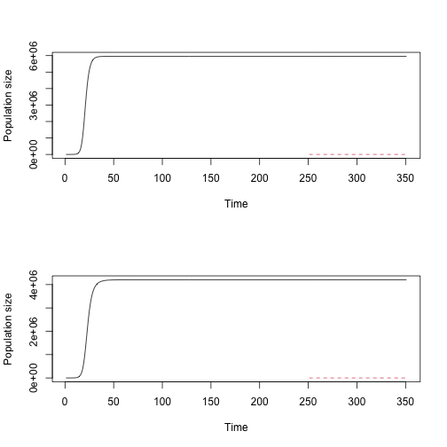
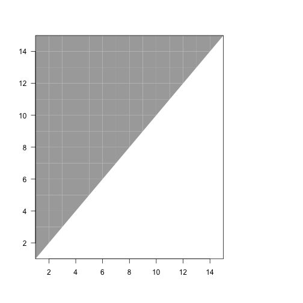
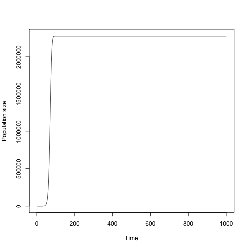
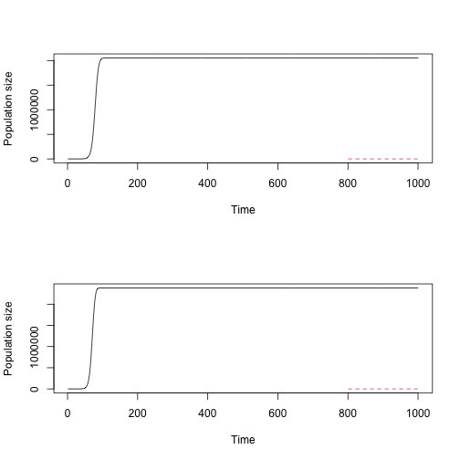
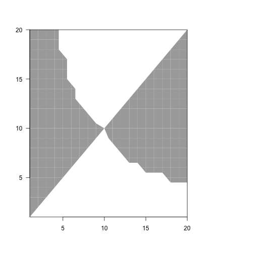
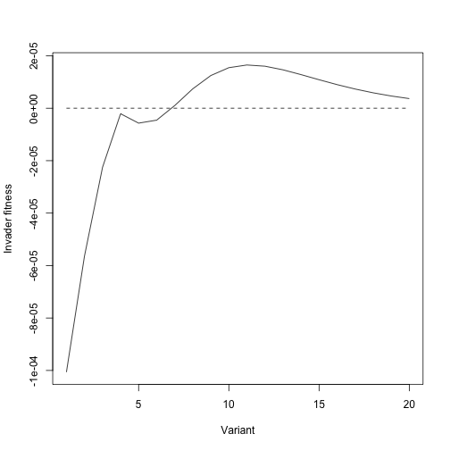

  <p style="text-indent: 20px">In this vignette, we will use the `cypa_data` dataset to illustrate pairwise invasibility analysis using package `adapt3`. We will conduct two such analyses, the first focused on testing variants created by altering matrix elements, and the second focused on testing variants created through alterations to vital rate models used in function-based MPM development. Users will note that the former allows a very general application of pairwise invasibility analysis to all studies generating MPMs. However, the latter allows a potentially greater toolset for the evaluation of trait optima. Both approaches utilize functions from and structures created by the package `lefko3`, and we encourage users to become familiar with that package to use package `adapt3` properly.</p>

  <p style="text-indent: 20px">To reduce vignette size, we have prevented some statements from running if they produce long stretches of output. Examples include most `summary()` calls. In these cases, we include hashtagged versions of these calls, and we encourage the user to run these statements without hashtags.</p>

  <p style="text-indent: 20px">This vignette is only a sample analysis. Detailed information and instructions on using `adapt3` will be made available over time. Please check available resources on <a href = "http://www.revolutionarydemography.com/projects.html">the projects page</a> of the `{r}evolutionary demography` website.</p>

### Organism and population

  <p style="text-indent: 20px">*Cypripedium parviflorum* (family Orchidaceae) is a long-lived herbaceous perennial, native to North America and particularly common near the Great Lakes. It typically lives in wet, calcareous wetlands on the edges of woodlands [@shefferson_estimating_2001]. Individuals begin life as dust seeds, which may or may not germinate the year following production. Germination leads to the protocorm stage, a life history stage in which the individual grows underground in a non-photosynthetic, mycoheterotrophic state [@rasmussen_orchids_1995]. They may live in this state for several years prior to becoming a seedling, at which point they may or may not sprout. Maturity involves the production of flowering sprouts, each with several leaves and typically only a single flower, although an individual may produce mostly non-flowering sprouts. Most individuals produce only a single sprout, and vegetative dormancy is common and can occur for overa decade in a single individual [@shefferson_drivers_2018].</p>

  <p style="text-indent: 20px">Data for this study were collected from a population in northeastern Illinois, from 2004 to 2009 [@shefferson_predicting_2017]. Each year at the start of the flowering season, all individuals at the site were located, with previously identified individuals identified based on their previous locations, and new individuals recorded via an exhaustive survey. Plant characteristics including the number of sprouts, which sprouts were flowering vs. non-flowering, and the number of flowers per sprout, were recorded for every individual in every year.</p>

### Dataset preparation

  <p style="text-indent: 20px">Package `adapt3` is built to take advantage of package `lefko3`, which offers a general language and architecture to build and analyze most kinds of matrix projection models, including even discretized integral projection models [@shefferson_lefko3_2021]. To start, we will load both `lefko3` and `adapt3`, and also load the dataset that we will use for our two examples.</p>

``` r
library(lefko3)
library(adapt3)

data(cypa_data)
dim(cypa_data)
#> [1] 1103   37
summary(cypa_data)
#>       plant_id        Inf.94            Veg.94            Inf.95           Veg.95          Inf.96           Veg.96     
#>  K NA     :  28   Min.   :0.00000   Min.   :0.00000   Min.   :0.0000   Min.   :0.000   Min.   :0.0000   Min.   :0.000  
#>  A NA     :  13   1st Qu.:0.00000   1st Qu.:0.00000   1st Qu.:0.0000   1st Qu.:0.000   1st Qu.:0.0000   1st Qu.:0.000  
#>  T NA     :  10   Median :0.00000   Median :0.00000   Median :0.0000   Median :0.000   Median :0.0000   Median :0.000  
#>  Willow NA:  10   Mean   :0.07253   Mean   :0.02267   Mean   :0.1732   Mean   :0.155   Mean   :0.2557   Mean   :0.282  
#>  X NA     :   7   3rd Qu.:0.00000   3rd Qu.:0.00000   3rd Qu.:0.0000   3rd Qu.:0.000   3rd Qu.:0.0000   3rd Qu.:0.000  
#>  Aspen NA :   6   Max.   :4.00000   Max.   :4.00000   Max.   :4.0000   Max.   :7.000   Max.   :6.0000   Max.   :6.000  
#>  (Other)  :1029                                                                                                        
#>      Inf.97           Veg.97          Inf.98           Veg.98           Inf.99           Veg.99           Inf.00      
#>  Min.   :0.0000   Min.   :0.000   Min.   :0.0000   Min.   :0.0000   Min.   :0.0000   Min.   :0.0000   Min.   :0.0000  
#>  1st Qu.:0.0000   1st Qu.:0.000   1st Qu.:0.0000   1st Qu.:0.0000   1st Qu.:0.0000   1st Qu.:0.0000   1st Qu.:0.0000  
#>  Median :0.0000   Median :0.000   Median :0.0000   Median :0.0000   Median :0.0000   Median :0.0000   Median :0.0000  
#>  Mean   :0.1333   Mean   :0.301   Mean   :0.2593   Mean   :0.2928   Mean   :0.3218   Mean   :0.2838   Mean   :0.2103  
#>  3rd Qu.:0.0000   3rd Qu.:0.000   3rd Qu.:0.0000   3rd Qu.:0.0000   3rd Qu.:0.0000   3rd Qu.:0.0000   3rd Qu.:0.0000  
#>  Max.   :4.0000   Max.   :7.000   Max.   :5.0000   Max.   :5.0000   Max.   :7.0000   Max.   :4.0000   Max.   :6.0000  
#>                                                                                                                       
#>      Veg.00           Inf.01           Veg.01           Inf.02           Veg.02           Inf.03           Veg.03      
#>  Min.   :0.0000   Min.   :0.0000   Min.   :0.0000   Min.   :0.0000   Min.   :0.0000   Min.   :0.0000   Min.   :0.0000  
#>  1st Qu.:0.0000   1st Qu.:0.0000   1st Qu.:0.0000   1st Qu.:0.0000   1st Qu.:0.0000   1st Qu.:0.0000   1st Qu.:0.0000  
#>  Median :0.0000   Median :0.0000   Median :0.0000   Median :0.0000   Median :0.0000   Median :0.0000   Median :0.0000  
#>  Mean   :0.3554   Mean   :0.2076   Mean   :0.3772   Mean   :0.2267   Mean   :0.2937   Mean   :0.1958   Mean   :0.3699  
#>  3rd Qu.:0.5000   3rd Qu.:0.0000   3rd Qu.:1.0000   3rd Qu.:0.0000   3rd Qu.:0.0000   3rd Qu.:0.0000   3rd Qu.:1.0000  
#>  Max.   :6.0000   Max.   :5.0000   Max.   :5.0000   Max.   :6.0000   Max.   :4.0000   Max.   :6.0000   Max.   :6.0000  
#>                                                                                                                        
#>      Inf.04            Veg.04           Inf.05           Veg.05           Inf.06            Veg.06           Inf.07       
#>  Min.   :0.00000   Min.   :0.0000   Min.   :0.0000   Min.   :0.0000   Min.   :0.00000   Min.   :0.0000   Min.   :0.00000  
#>  1st Qu.:0.00000   1st Qu.:0.0000   1st Qu.:0.0000   1st Qu.:0.0000   1st Qu.:0.00000   1st Qu.:0.0000   1st Qu.:0.00000  
#>  Median :0.00000   Median :0.0000   Median :0.0000   Median :0.0000   Median :0.00000   Median :0.0000   Median :0.00000  
#>  Mean   :0.09791   Mean   :0.2684   Mean   :0.1233   Mean   :0.3073   Mean   :0.03626   Mean   :0.2013   Mean   :0.03264  
#>  3rd Qu.:0.00000   3rd Qu.:0.0000   3rd Qu.:0.0000   3rd Qu.:0.0000   3rd Qu.:0.00000   3rd Qu.:0.0000   3rd Qu.:0.00000  
#>  Max.   :4.00000   Max.   :4.0000   Max.   :6.0000   Max.   :4.0000   Max.   :3.00000   Max.   :4.0000   Max.   :3.00000  
#>                                                                                                                           
#>      Veg.07           Inf.08            Veg.08           Inf.09            Veg.09           Inf.10            Veg.10      
#>  Min.   :0.0000   Min.   :0.00000   Min.   :0.0000   Min.   :0.00000   Min.   :0.0000   Min.   :0.00000   Min.   :0.0000  
#>  1st Qu.:0.0000   1st Qu.:0.00000   1st Qu.:0.0000   1st Qu.:0.00000   1st Qu.:0.0000   1st Qu.:0.00000   1st Qu.:0.0000  
#>  Median :0.0000   Median :0.00000   Median :0.0000   Median :0.00000   Median :0.0000   Median :0.00000   Median :0.0000  
#>  Mean   :0.1578   Mean   :0.05712   Mean   :0.1242   Mean   :0.08885   Mean   :0.1868   Mean   :0.08613   Mean   :0.1668  
#>  3rd Qu.:0.0000   3rd Qu.:0.00000   3rd Qu.:0.0000   3rd Qu.:0.00000   3rd Qu.:0.0000   3rd Qu.:0.00000   3rd Qu.:0.0000  
#>  Max.   :4.0000   Max.   :3.00000   Max.   :4.0000   Max.   :5.00000   Max.   :6.0000   Max.   :4.00000   Max.   :4.0000  
#>                                                                                                                           
#>      Inf.11           Veg.11      
#>  Min.   :0.0000   Min.   :0.0000  
#>  1st Qu.:0.0000   1st Qu.:0.0000  
#>  Median :0.0000   Median :0.0000  
#>  Mean   :0.1342   Mean   :0.1886  
#>  3rd Qu.:0.0000   3rd Qu.:0.0000  
#>  Max.   :4.0000   Max.   :4.0000  
#> 
```

  <p style="text-indent: 20px">This dataset includes information on 1103 individuals arranged horizontally, by row. There are 37 variables, by column. The first column gives identifying information for each individual. This is followed by 18 sets of two columns, each named `Inf.XX` and `Veg.XX`, where `XX` corresponds to the year of observation and with years organized consecutively. Thus, columns 2-3 refer to year 1994, columns 4-5 refer to year 1995, etc. This strictly repeating pattern allows us to manipulate the original dataset quickly and efficiently via `lefko3` (see our free online e-book called <a href = "https://bookdown.org/cdorm/lefko3gentle/">*lefko3: a gentle introduction*</a> for more).</p>

### Pairwise invasibility analysis focused on matrix element manipulation

  <p style="text-indent: 20px">Our first example will focus on running pairwise invasibility analyses in which matrix elements are manipulated to create our pairs of residents and mutants. Because we use existing MPMs, the process generally proceeds quite quickly, and only slows when using giant matrices such as might occur in historical MPM projection. To make this process easier, we will develop a relatively small, stage-based empirical MPM</p>
  
  <p style="text-indent: 20px">Per `lefko3` terminology, we will develop a stageframe that encapsulates our life history model by noting all of the relevant characteristics of each stage, as below.</p>

``` r
sizevector <- c(0, 0, 0, 0, 1, 2.5, 4.5, 8, 17.5)
stagevector <- c("SD", "P1", "SL", "D", "XSm", "Sm", "Md", "Lg", "XLg")
repvector <- c(0, 0, 0, 0, 1, 1, 1, 1, 1)
obsvector <- c(0, 0, 0, 0, 1, 1, 1, 1, 1)
matvector <- c(0, 0, 0, 1, 1, 1, 1, 1, 1)
immvector <- c(0, 1, 1, 0, 0, 0, 0, 0, 0)
propvector <- c(1, 0, 0, 0, 0, 0, 0, 0, 0)
indataset <- c(0, 0, 0, 1, 1, 1, 1, 1, 1)
binvec <- c(0, 0, 0, 0.5, 0.5, 1, 1, 2.5, 7)

cypframe_raw <- sf_create(sizes = sizevector, stagenames = stagevector,
  repstatus = repvector, obsstatus = obsvector, matstatus = matvector,
  propstatus = propvector, immstatus = immvector, indataset = indataset,
  binhalfwidth = binvec)
cypframe_raw
#>   stage size size_b size_c min_age max_age repstatus obsstatus propstatus immstatus matstatus indataset binhalfwidth_raw
#> 1    SD  0.0     NA     NA      NA      NA         0         0          1         0         0         0              0.0
#> 2    P1  0.0     NA     NA      NA      NA         0         0          0         1         0         0              0.0
#> 3    SL  0.0     NA     NA      NA      NA         0         0          0         1         0         0              0.0
#> 4     D  0.0     NA     NA      NA      NA         0         0          0         0         1         1              0.5
#> 5   XSm  1.0     NA     NA      NA      NA         1         1          0         0         1         1              0.5
#> 6    Sm  2.5     NA     NA      NA      NA         1         1          0         0         1         1              1.0
#> 7    Md  4.5     NA     NA      NA      NA         1         1          0         0         1         1              1.0
#> 8    Lg  8.0     NA     NA      NA      NA         1         1          0         0         1         1              2.5
#> 9   XLg 17.5     NA     NA      NA      NA         1         1          0         0         1         1              7.0
#>   sizebin_min sizebin_max sizebin_center sizebin_width binhalfwidthb_raw sizebinb_min sizebinb_max sizebinb_center sizebinb_width
#> 1         0.0         0.0            0.0             0                NA           NA           NA              NA             NA
#> 2         0.0         0.0            0.0             0                NA           NA           NA              NA             NA
#> 3         0.0         0.0            0.0             0                NA           NA           NA              NA             NA
#> 4        -0.5         0.5            0.0             1                NA           NA           NA              NA             NA
#> 5         0.5         1.5            1.0             1                NA           NA           NA              NA             NA
#> 6         1.5         3.5            2.5             2                NA           NA           NA              NA             NA
#> 7         3.5         5.5            4.5             2                NA           NA           NA              NA             NA
#> 8         5.5        10.5            8.0             5                NA           NA           NA              NA             NA
#> 9        10.5        24.5           17.5            14                NA           NA           NA              NA             NA
#>   binhalfwidthc_raw sizebinc_min sizebinc_max sizebinc_center sizebinc_width group       comments
#> 1                NA           NA           NA              NA             NA     0 No description
#> 2                NA           NA           NA              NA             NA     0 No description
#> 3                NA           NA           NA              NA             NA     0 No description
#> 4                NA           NA           NA              NA             NA     0 No description
#> 5                NA           NA           NA              NA             NA     0 No description
#> 6                NA           NA           NA              NA             NA     0 No description
#> 7                NA           NA           NA              NA             NA     0 No description
#> 8                NA           NA           NA              NA             NA     0 No description
#> 9                NA           NA           NA              NA             NA     0 No description
```
  
  <p style="text-indent: 20px">Next we will create our verticalized dataset, in which our horizontal dataset is restructured to have all data for each individual split into blocks of three consecutive monitoring occasions, as below. Note that, because we are using the `stageassign` argument, we can have `R` assign stages to each individual in each occasion. Note also our use of the `summary_hfv()` function, which provides specialized, useful output for this style of data frame.</p>

``` r
cypraw_v1 <- verticalize3(data = cypa_data, noyears = 18, firstyear = 1994,
  individcol = "plant_id", blocksize = 2, sizeacol = "Inf.94",
  sizebcol = "Veg.94", repstracol = "Inf.94", fecacol = "Inf.94",
  stageassign = cypframe_raw, stagesize = "sizeadded", NAas0 = TRUE,
  NRasRep = TRUE)
summary_hfv(cypraw_v1)
#> 
#> This hfv dataset contains 6871 rows, 51 variables, 1 population, 
#> 1 patch, 1025 individuals, and 17 time steps.
#>      rowid           popid             patchid               individ         year2        firstseen       lastseen   
#>  Min.   :   1.0   Length:6871        Length:6871        K NA     :  62   Min.   :1994   Min.   :1994   Min.   :1994  
#>  1st Qu.: 291.0   Class :character   Class :character   A NA     :  27   1st Qu.:1999   1st Qu.:1995   1st Qu.:2004  
#>  Median : 557.0   Mode  :character   Mode  :character   X NA     :  24   Median :2002   Median :1997   Median :2009  
#>  Mean   : 549.7                                         T NA     :  23   Mean   :2002   Mean   :1997   Mean   :2007  
#>  3rd Qu.: 804.0                                         Willow NA:  17   3rd Qu.:2005   3rd Qu.:1999   3rd Qu.:2011  
#>  Max.   :1103.0                                         X 3      :  17   Max.   :2010   Max.   :2010   Max.   :2011  
#>                                                         (Other)  :6701                                               
#>      obsage        obslifespan         sizea1           sizeb1         size1added        repstra1       repstr1added   
#>  Min.   : 1.000   Min.   : 0.000   Min.   :0.0000   Min.   :0.0000   Min.   :0.0000   Min.   :0.0000   Min.   :0.0000  
#>  1st Qu.: 2.000   1st Qu.: 6.000   1st Qu.:0.0000   1st Qu.:0.0000   1st Qu.:0.0000   1st Qu.:0.0000   1st Qu.:0.0000  
#>  Median : 5.000   Median :10.000   Median :0.0000   Median :0.0000   Median :1.0000   Median :0.0000   Median :0.0000  
#>  Mean   : 5.541   Mean   : 9.452   Mean   :0.3484   Mean   :0.5244   Mean   :0.8728   Mean   :0.3484   Mean   :0.3484  
#>  3rd Qu.: 8.000   3rd Qu.:14.000   3rd Qu.:0.0000   3rd Qu.:1.0000   3rd Qu.:1.0000   3rd Qu.:0.0000   3rd Qu.:0.0000  
#>  Max.   :17.000   Max.   :17.000   Max.   :7.0000   Max.   :7.0000   Max.   :7.0000   Max.   :7.0000   Max.   :7.0000  
#>                                                                                                                        
#>      feca1          fec1added        obsstatus1       repstatus1      fecstatus1      matstatus1         alive1      
#>  Min.   :0.0000   Min.   :0.0000   Min.   :0.0000   Min.   :0.000   Min.   :0.000   Min.   :0.0000   Min.   :0.0000  
#>  1st Qu.:0.0000   1st Qu.:0.0000   1st Qu.:0.0000   1st Qu.:0.000   1st Qu.:0.000   1st Qu.:1.0000   1st Qu.:1.0000  
#>  Median :0.0000   Median :0.0000   Median :1.0000   Median :0.000   Median :0.000   Median :1.0000   Median :1.0000  
#>  Mean   :0.3484   Mean   :0.3484   Mean   :0.5472   Mean   :0.247   Mean   :0.247   Mean   :0.8395   Mean   :0.8395  
#>  3rd Qu.:0.0000   3rd Qu.:0.0000   3rd Qu.:1.0000   3rd Qu.:0.000   3rd Qu.:0.000   3rd Qu.:1.0000   3rd Qu.:1.0000  
#>  Max.   :7.0000   Max.   :7.0000   Max.   :1.0000   Max.   :1.000   Max.   :1.000   Max.   :1.0000   Max.   :1.0000  
#>                                                                                                                      
#>     stage1           stage1index        sizea2           sizeb2         size2added       repstra2       repstr2added   
#>  Length:6871        Min.   :0.000   Min.   :0.0000   Min.   :0.0000   Min.   :0.000   Min.   :0.0000   Min.   :0.0000  
#>  Class :character   1st Qu.:4.000   1st Qu.:0.0000   1st Qu.:0.0000   1st Qu.:0.000   1st Qu.:0.0000   1st Qu.:0.0000  
#>  Mode  :character   Median :5.000   Median :0.0000   Median :0.0000   Median :1.000   Median :0.0000   Median :0.0000  
#>                     Mean   :4.145   Mean   :0.4139   Mean   :0.6656   Mean   :1.079   Mean   :0.4139   Mean   :0.4139  
#>                     3rd Qu.:5.000   3rd Qu.:1.0000   3rd Qu.:1.0000   3rd Qu.:1.000   3rd Qu.:1.0000   3rd Qu.:1.0000  
#>                     Max.   :8.000   Max.   :7.0000   Max.   :7.0000   Max.   :7.000   Max.   :7.0000   Max.   :7.0000  
#>                                                                                                                        
#>      feca2          fec2added        obsstatus2      repstatus2       fecstatus2       matstatus2     alive2     stage2         
#>  Min.   :0.0000   Min.   :0.0000   Min.   :0.000   Min.   :0.0000   Min.   :0.0000   Min.   :1    Min.   :1   Length:6871       
#>  1st Qu.:0.0000   1st Qu.:0.0000   1st Qu.:0.000   1st Qu.:0.0000   1st Qu.:0.0000   1st Qu.:1    1st Qu.:1   Class :character  
#>  Median :0.0000   Median :0.0000   Median :1.000   Median :0.0000   Median :0.0000   Median :1    Median :1   Mode  :character  
#>  Mean   :0.4139   Mean   :0.4139   Mean   :0.697   Mean   :0.2969   Mean   :0.2969   Mean   :1    Mean   :1                     
#>  3rd Qu.:1.0000   3rd Qu.:1.0000   3rd Qu.:1.000   3rd Qu.:1.0000   3rd Qu.:1.0000   3rd Qu.:1    3rd Qu.:1                     
#>  Max.   :7.0000   Max.   :7.0000   Max.   :1.000   Max.   :1.0000   Max.   :1.0000   Max.   :1    Max.   :1                     
#>                                                                                                                                 
#>   stage2index        sizea3          sizeb3         size3added        repstra3      repstr3added       feca3      
#>  Min.   :4.000   Min.   :0.000   Min.   :0.0000   Min.   :0.0000   Min.   :0.000   Min.   :0.000   Min.   :0.000  
#>  1st Qu.:4.000   1st Qu.:0.000   1st Qu.:0.0000   1st Qu.:0.0000   1st Qu.:0.000   1st Qu.:0.000   1st Qu.:0.000  
#>  Median :5.000   Median :0.000   Median :0.0000   Median :1.0000   Median :0.000   Median :0.000   Median :0.000  
#>  Mean   :4.982   Mean   :0.335   Mean   :0.5523   Mean   :0.8874   Mean   :0.335   Mean   :0.335   Mean   :0.335  
#>  3rd Qu.:5.000   3rd Qu.:0.000   3rd Qu.:1.0000   3rd Qu.:1.0000   3rd Qu.:0.000   3rd Qu.:0.000   3rd Qu.:0.000  
#>  Max.   :8.000   Max.   :7.000   Max.   :7.0000   Max.   :7.0000   Max.   :7.000   Max.   :7.000   Max.   :7.000  
#>                                                                                                                   
#>    fec3added       obsstatus3      repstatus3       fecstatus3       matstatus3     alive3         stage3         
#>  Min.   :0.000   Min.   :0.000   Min.   :0.0000   Min.   :0.0000   Min.   :1    Min.   :0.000   Length:6871       
#>  1st Qu.:0.000   1st Qu.:0.000   1st Qu.:0.0000   1st Qu.:0.0000   1st Qu.:1    1st Qu.:1.000   Class :character  
#>  Median :0.000   Median :1.000   Median :0.0000   Median :0.0000   Median :1    Median :1.000   Mode  :character  
#>  Mean   :0.335   Mean   :0.571   Mean   :0.2391   Mean   :0.2391   Mean   :1    Mean   :0.874                     
#>  3rd Qu.:0.000   3rd Qu.:1.000   3rd Qu.:0.0000   3rd Qu.:0.0000   3rd Qu.:1    3rd Qu.:1.000                     
#>  Max.   :7.000   Max.   :1.000   Max.   :1.0000   Max.   :1.0000   Max.   :1    Max.   :1.000                     
#>                                                                                                                   
#>   stage3index   
#>  Min.   :0.000  
#>  1st Qu.:4.000  
#>  Median :5.000  
#>  Mean   :4.301  
#>  3rd Qu.:5.000  
#>  Max.   :8.000  
#> 
```
  
  <p style="text-indent: 20px">Now we will create our MPM. Later on, this will be projected through our invasibility analyses, so we need to be sure that it is constructed correctly. See our online book, <a href = "https://bookdown.org/cdorm/lefko3gentle/">lefko3: a gentle introduction</a>, for further material on how to construct MPMs properly.</p>

``` r
cypsupp2r <- supplemental(stage3 = c("SD", "P1", "SL", "D", "XSm", "Sm", "SD",
  "P1"),
  stage2 = c("SD", "SD", "P1", "SL", "SL", "SL", "rep", "rep"),
  eststage3 = c(NA, NA, NA, "D", "XSm", "Sm", NA, NA),
  eststage2 = c(NA, NA, NA, "XSm", "XSm", "XSm", NA, NA),
  givenrate = c(0.10, 0.20, 0.25, NA, NA, NA, NA, NA),
  multiplier = c(NA, NA, NA, NA, NA, NA, 5000, 5000),
  type =c(1, 1, 1, 1, 1, 1, 3, 3),
  stageframe = cypframe_raw, historical = FALSE)
#> Warning: NA values in argument multiplier will be treated as 1 values.

cypmatrix2r <- rlefko2(data = cypraw_v1, stageframe = cypframe_raw, 
  year = "all", patch = "all", stages = c("stage3", "stage2", "stage1"),
  size = c("size3added", "size2added"), supplement = cypsupp2r,
  yearcol = "year2", patchcol = "patchid", indivcol = "individ")
cypmean <- lmean(cypmatrix2r)

summary(cypmean)
#> 
#> This ahistorical lefkoMat object contains 1 matrix.
#> 
#> Each matrix is square with 9 rows and columns, and a total of 81 elements.
#> A total of 31 survival transitions were estimated, with 31 per matrix.
#> A total of 8 fecundity transitions were estimated, with 8 per matrix.
#> This lefkoMat object covers 1 population, 1 patch, and 0 time steps.
#> 
#> The dataset contains a total of 1025 unique individuals and 6871 unique transitions.
#> 
#> Survival probability sum check (each matrix represented by column in order):
#>          [,1]
#> Min.    0.000
#> 1st Qu. 0.300
#> Median  0.783
#> Mean    0.594
#> 3rd Qu. 0.858
#> Max.    0.941
#> 
#> 
#> Stages without connections leading to the rest of the life cycle found in matrices: 1
```
  
  <p style="text-indent: 20px">Now that we have our core MPM, we will need to clarify some of the assumptions of the projection. First, let's set up a starting vector residents and mutants. We will use the typical setting in this case, assuming that both variants will start with a single individual. We will make that individual a protocorm, since that is the youngest post-germination individual possible.</p>

``` r
cyp_start <- start_input(cypmean, stage2 = "P1", value = 1)
cyp_start
#>   stage2 stage_id_2 stage1 stage_id_1 age2 row_num value
#> 1     P1          2     NA         NA   NA       2     1
```
  
  <p style="text-indent: 20px">Next we need to clarify how density dependence will operate on the demography of this population. In herbaceous perennial plants, the germination stage is most commonly negatively density dependent. In orchids, germination may be from a fresh seed, or from a previously dormant seed, and we will assume density dependence in both. Determining the exact nature and proper parameterization of density dependence is too great a topic for this vignette, and so we utilize the following two-parameter Ricker function-based approach, which we know works in this case based on our own previous studies.</p>

``` r
c2d_4 <- density_input(cypmean, stage3 = c("P1", "P1"), stage2= c("SD", "rep"),
  style = 2, time_delay = 1, alpha = 0.005, beta = 0.000005, type = c(2, 2))
c2d_4
#>   stage3 stage2 stage1 age2 style alpha  beta time_delay type type_t12
#> 1     P1     SD     NA   NA     2 0.005 5e-06          1    2        1
#> 2     P1    XSm     NA   NA     2 0.005 5e-06          1    2        1
#> 3     P1     Sm     NA   NA     2 0.005 5e-06          1    2        1
#> 4     P1     Md     NA   NA     2 0.005 5e-06          1    2        1
#> 5     P1     Lg     NA   NA     2 0.005 5e-06          1    2        1
#> 6     P1    XLg     NA   NA     2 0.005 5e-06          1    2        1
```
  
  <p style="text-indent: 20px">Next, we need to propose the variants to test. The information regarding the variants is probably the most important information to provide to R, because it clarifies the trait(s) under investigation. In the following data frame, which we call a trait axis, we define 15 genetic variants, each of which differs in fecundity multipliers. In a pairwise invasibility analysis, each possible pair permutation will be projected, with one serving as the resident population and the other as the mutant invader.</p>

``` r
cyp_ta <- trait_axis(stageframe = cypframe_raw, stage3 = rep("P1", 15),
  stage2 = rep("rep", 15), multiplier = seq(from=1, to=3, length.out = 15),
  type = rep(2, 15))
cyp_ta
#>    variant stage3 stage2 stage1 age3 age2 eststage3 eststage2 eststage1 estage3 estage2 givenrate offset multiplier convtype
#> 1        1     P1    rep   <NA>   NA   NA      <NA>      <NA>      <NA>      NA      NA        NA     NA   1.000000        2
#> 2        2     P1    rep   <NA>   NA   NA      <NA>      <NA>      <NA>      NA      NA        NA     NA   1.142857        2
#> 3        3     P1    rep   <NA>   NA   NA      <NA>      <NA>      <NA>      NA      NA        NA     NA   1.285714        2
#> 4        4     P1    rep   <NA>   NA   NA      <NA>      <NA>      <NA>      NA      NA        NA     NA   1.428571        2
#> 5        5     P1    rep   <NA>   NA   NA      <NA>      <NA>      <NA>      NA      NA        NA     NA   1.571429        2
#> 6        6     P1    rep   <NA>   NA   NA      <NA>      <NA>      <NA>      NA      NA        NA     NA   1.714286        2
#> 7        7     P1    rep   <NA>   NA   NA      <NA>      <NA>      <NA>      NA      NA        NA     NA   1.857143        2
#> 8        8     P1    rep   <NA>   NA   NA      <NA>      <NA>      <NA>      NA      NA        NA     NA   2.000000        2
#> 9        9     P1    rep   <NA>   NA   NA      <NA>      <NA>      <NA>      NA      NA        NA     NA   2.142857        2
#> 10      10     P1    rep   <NA>   NA   NA      <NA>      <NA>      <NA>      NA      NA        NA     NA   2.285714        2
#> 11      11     P1    rep   <NA>   NA   NA      <NA>      <NA>      <NA>      NA      NA        NA     NA   2.428571        2
#> 12      12     P1    rep   <NA>   NA   NA      <NA>      <NA>      <NA>      NA      NA        NA     NA   2.571429        2
#> 13      13     P1    rep   <NA>   NA   NA      <NA>      <NA>      <NA>      NA      NA        NA     NA   2.714286        2
#> 14      14     P1    rep   <NA>   NA   NA      <NA>      <NA>      <NA>      NA      NA        NA     NA   2.857143        2
#> 15      15     P1    rep   <NA>   NA   NA      <NA>      <NA>      <NA>      NA      NA        NA     NA   3.000000        2
#>    convtype_t12 surv_dev obs_dev size_dev sizeb_dev sizec_dev repst_dev fec_dev jsurv_dev jobs_dev jsize_dev jsizeb_dev
#> 1            NA       NA      NA       NA        NA        NA        NA      NA        NA       NA        NA         NA
#> 2            NA       NA      NA       NA        NA        NA        NA      NA        NA       NA        NA         NA
#> 3            NA       NA      NA       NA        NA        NA        NA      NA        NA       NA        NA         NA
#> 4            NA       NA      NA       NA        NA        NA        NA      NA        NA       NA        NA         NA
#> 5            NA       NA      NA       NA        NA        NA        NA      NA        NA       NA        NA         NA
#> 6            NA       NA      NA       NA        NA        NA        NA      NA        NA       NA        NA         NA
#> 7            NA       NA      NA       NA        NA        NA        NA      NA        NA       NA        NA         NA
#> 8            NA       NA      NA       NA        NA        NA        NA      NA        NA       NA        NA         NA
#> 9            NA       NA      NA       NA        NA        NA        NA      NA        NA       NA        NA         NA
#> 10           NA       NA      NA       NA        NA        NA        NA      NA        NA       NA        NA         NA
#> 11           NA       NA      NA       NA        NA        NA        NA      NA        NA       NA        NA         NA
#> 12           NA       NA      NA       NA        NA        NA        NA      NA        NA       NA        NA         NA
#> 13           NA       NA      NA       NA        NA        NA        NA      NA        NA       NA        NA         NA
#> 14           NA       NA      NA       NA        NA        NA        NA      NA        NA       NA        NA         NA
#> 15           NA       NA      NA       NA        NA        NA        NA      NA        NA       NA        NA         NA
#>    jsizec_dev jrepst_dev jmatst_dev
#> 1          NA         NA         NA
#> 2          NA         NA         NA
#> 3          NA         NA         NA
#> 4          NA         NA         NA
#> 5          NA         NA         NA
#> 6          NA         NA         NA
#> 7          NA         NA         NA
#> 8          NA         NA         NA
#> 9          NA         NA         NA
#> 10         NA         NA         NA
#> 11         NA         NA         NA
#> 12         NA         NA         NA
#> 13         NA         NA         NA
#> 14         NA         NA         NA
#> 15         NA         NA         NA
```
  
  <p style="text-indent: 20px">Finally, we will run our invasibility analysis.</p>

``` r
cyp_inv <- invade3(axis = cyp_ta, mpm = cypmean, density = c2d_4, times = 350,
  starts = cyp_start, entry_time = c(0, 250), fitness_times = 30,
  var_per_run = 2)
```
  
  <p style="text-indent: 20px">Let's see some diagnostics, in particular by plotting the sizes of the resident and invader subpopulations in each time step. We will look at two separate runs.</p>

``` r
par(mfrow = c(2, 1))
plot(cyp_inv, pip = FALSE, run = 25)
plot(cyp_inv, pip = FALSE, run = 50)
```


  
  <p style="text-indent: 20px">In the plots above, the resident variant is given in solid black, while the invader variant, which is introduced at time 250, is given as a dashed red line. It appears that the invader never gained a foothold in the population, likely going extinct while the resident grew to a stable population size. However, we can also take a peek at the fitness values in the pairwise simulations, as below.</p>

``` r
summary(cyp_inv$fitness)
#>  simulation_num      rep       variant1     variant2    entrytime1   entrytime2  fitness_variant1     fitness_variant2    
#>  Min.   :  1    Min.   :1   Min.   : 1   Min.   : 1   Min.   :0    Min.   :250   Min.   :-64933.135   Min.   :    -1.343  
#>  1st Qu.: 57    1st Qu.:1   1st Qu.: 4   1st Qu.: 4   1st Qu.:0    1st Qu.:250   1st Qu.:  -118.362   1st Qu.:    -0.660  
#>  Median :113    Median :1   Median : 8   Median : 8   Median :0    Median :250   Median :     0.000   Median :     0.000  
#>  Mean   :113    Mean   :1   Mean   : 8   Mean   : 8   Mean   :0    Mean   :250   Mean   : -2442.037   Mean   :  5880.032  
#>  3rd Qu.:169    3rd Qu.:1   3rd Qu.:12   3rd Qu.:12   3rd Qu.:0    3rd Qu.:250   3rd Qu.:     0.928   3rd Qu.:   162.300  
#>  Max.   :225    Max.   :1   Max.   :15   Max.   :15   Max.   :0    Max.   :250   Max.   :     1.531   Max.   :180963.650
```
  
  <p style="text-indent: 20px">The data frame that we see the summary of above shows the fitness for both the resident (`variant1`) and the invader (`variant2`). Note that the invaders' fitness, assessed as the Lyapunov coefficient for the final 30 times in each simulation, shows that some invaders actually had very high growth. These are likely cases in which low fecundity multiplier residents were run with high fecundity multiplier invaders. Let's view the pairwise invasibility plot (PIP) to see if an ESS resulted from this. This will give us a sense of whether we have any evolutionarily stable equilibria, or whether natural selection appears to completely directional.</p>

``` r
plot(cyp_inv)
```


  
  <p style="text-indent: 20px">It appears that natural selection is completely directional here, favoring increasingly large fruiting value multipliers.</p>
  
### Pairwise invasibility analysis focused on vital rate model manipulation

  <p style="text-indent: 20px">Let's now move on to looking at analyzing function-based MPMs. This approach works best when vital rates are given as linear or non-linear functions of size, reproductive status, and other variables. Here, the linear or non-linear models can be manipulated by altering their y-intercepts.</p>
  
  <p style="text-indent: 20px">Our example will once again focus on *Cypripedium parviflorum*. However, this time we will attempt to replicate the pairwise invasibility analysis results from the ahistorical, deterministic analysis of the same population published in @shefferson_life_2014. That analysis was used to explore the adaptive context of vegetative dormancy, and hence imperfect sprouting, and found an evolutionarily stable strategy at an intermediate level of sprouting. The dataset that we will use is not exactly the same as in the paper, nor is the methodology exactly the same, but our results should be similar. Because we will use a function-based approach, which is very similar to building an integral projection model (IPM), we will use a larger resolution life history model than used in that paper, allowing for all observed sizes of both vegetative and flowering adults, where size is defined by the number of sprouts.</p>

``` r
stagevector <- c("SD", "P1", "SL", "D", "V1", "V2", "V3", "V4", "V5", "V6",
  "V7", "F1", "F2", "F3", "F4", "F5", "F6", "F7")
indataset <- c(0, 0, 0, 1, rep(1, 7), rep(1, 7))
sizevector <- c(0, 0, 0, 0, c(1:7), c(1:7))
repvector <- c(0, 0, 0, 0, rep(0, 7), rep(1, 7))
obsvector <- c(0, 0, 0, 0, rep(1, 7), rep(1, 7))
matvector <- c(0, 0, 0, 1, rep(1, 7), rep(1, 7))
immvector <- c(0, 1, 1, 0, rep(0, 7), rep(0, 7))
propvector <- c(1, 0, 0, 0, rep(0, 7), rep(0, 7))
comments <- c("Dormant seed", "Protocorm", "Seedling", "Veg dorm",
  "Veg adult 1 stem", "Veg adult 2 stems", "Veg adult 3 stems",
  "Veg adult 4 stems", "Veg adult 5 stems", "Veg adult 6 stems",
  "Veg adult 7 stems", "Flo adult 1 stem", "Flo adult 2 stems",
  "Flo adult 3 stems", "Flo adult 4 stems", "Flo adult 5 stems",
  "Flo adult 6 stems", "Flo adult 7 stems")

cypframe_fb <- sf_create(sizes = sizevector, stagenames = stagevector, 
  repstatus = repvector, obsstatus = obsvector, matstatus = matvector, 
  propstatus = propvector, immstatus = immvector, indataset = indataset,
  comments = comments)
cypframe_fb
#>    stage size size_b size_c min_age max_age repstatus obsstatus propstatus immstatus matstatus indataset binhalfwidth_raw
#> 1     SD    0     NA     NA      NA      NA         0         0          1         0         0         0              0.5
#> 2     P1    0     NA     NA      NA      NA         0         0          0         1         0         0              0.5
#> 3     SL    0     NA     NA      NA      NA         0         0          0         1         0         0              0.5
#> 4      D    0     NA     NA      NA      NA         0         0          0         0         1         1              0.5
#> 5     V1    1     NA     NA      NA      NA         0         1          0         0         1         1              0.5
#> 6     V2    2     NA     NA      NA      NA         0         1          0         0         1         1              0.5
#> 7     V3    3     NA     NA      NA      NA         0         1          0         0         1         1              0.5
#> 8     V4    4     NA     NA      NA      NA         0         1          0         0         1         1              0.5
#> 9     V5    5     NA     NA      NA      NA         0         1          0         0         1         1              0.5
#> 10    V6    6     NA     NA      NA      NA         0         1          0         0         1         1              0.5
#> 11    V7    7     NA     NA      NA      NA         0         1          0         0         1         1              0.5
#> 12    F1    1     NA     NA      NA      NA         1         1          0         0         1         1              0.5
#> 13    F2    2     NA     NA      NA      NA         1         1          0         0         1         1              0.5
#> 14    F3    3     NA     NA      NA      NA         1         1          0         0         1         1              0.5
#> 15    F4    4     NA     NA      NA      NA         1         1          0         0         1         1              0.5
#> 16    F5    5     NA     NA      NA      NA         1         1          0         0         1         1              0.5
#> 17    F6    6     NA     NA      NA      NA         1         1          0         0         1         1              0.5
#> 18    F7    7     NA     NA      NA      NA         1         1          0         0         1         1              0.5
#>    sizebin_min sizebin_max sizebin_center sizebin_width binhalfwidthb_raw sizebinb_min sizebinb_max sizebinb_center
#> 1         -0.5         0.5              0             1                NA           NA           NA              NA
#> 2         -0.5         0.5              0             1                NA           NA           NA              NA
#> 3         -0.5         0.5              0             1                NA           NA           NA              NA
#> 4         -0.5         0.5              0             1                NA           NA           NA              NA
#> 5          0.5         1.5              1             1                NA           NA           NA              NA
#> 6          1.5         2.5              2             1                NA           NA           NA              NA
#> 7          2.5         3.5              3             1                NA           NA           NA              NA
#> 8          3.5         4.5              4             1                NA           NA           NA              NA
#> 9          4.5         5.5              5             1                NA           NA           NA              NA
#> 10         5.5         6.5              6             1                NA           NA           NA              NA
#> 11         6.5         7.5              7             1                NA           NA           NA              NA
#> 12         0.5         1.5              1             1                NA           NA           NA              NA
#> 13         1.5         2.5              2             1                NA           NA           NA              NA
#> 14         2.5         3.5              3             1                NA           NA           NA              NA
#> 15         3.5         4.5              4             1                NA           NA           NA              NA
#> 16         4.5         5.5              5             1                NA           NA           NA              NA
#> 17         5.5         6.5              6             1                NA           NA           NA              NA
#> 18         6.5         7.5              7             1                NA           NA           NA              NA
#>    sizebinb_width binhalfwidthc_raw sizebinc_min sizebinc_max sizebinc_center sizebinc_width group          comments
#> 1              NA                NA           NA           NA              NA             NA     0      Dormant seed
#> 2              NA                NA           NA           NA              NA             NA     0         Protocorm
#> 3              NA                NA           NA           NA              NA             NA     0          Seedling
#> 4              NA                NA           NA           NA              NA             NA     0          Veg dorm
#> 5              NA                NA           NA           NA              NA             NA     0  Veg adult 1 stem
#> 6              NA                NA           NA           NA              NA             NA     0 Veg adult 2 stems
#> 7              NA                NA           NA           NA              NA             NA     0 Veg adult 3 stems
#> 8              NA                NA           NA           NA              NA             NA     0 Veg adult 4 stems
#> 9              NA                NA           NA           NA              NA             NA     0 Veg adult 5 stems
#> 10             NA                NA           NA           NA              NA             NA     0 Veg adult 6 stems
#> 11             NA                NA           NA           NA              NA             NA     0 Veg adult 7 stems
#> 12             NA                NA           NA           NA              NA             NA     0  Flo adult 1 stem
#> 13             NA                NA           NA           NA              NA             NA     0 Flo adult 2 stems
#> 14             NA                NA           NA           NA              NA             NA     0 Flo adult 3 stems
#> 15             NA                NA           NA           NA              NA             NA     0 Flo adult 4 stems
#> 16             NA                NA           NA           NA              NA             NA     0 Flo adult 5 stems
#> 17             NA                NA           NA           NA              NA             NA     0 Flo adult 6 stems
#> 18             NA                NA           NA           NA              NA             NA     0 Flo adult 7 stems
```
  
  <p style="text-indent: 20px">Now we will standardize our dataset using the new life history model, allowing `lefko3` to develop new stage calls in all cases.</p>

``` r
cypraw_v2 <- verticalize3(data = cypa_data, noyears = 18, firstyear = 1994,
  individcol = "plant_id", blocksize = 2, sizeacol = "Inf.94",
  sizebcol = "Veg.94", repstracol = "Inf.94", fecacol = "Inf.94",
  stageassign = cypframe_fb, stagesize = "sizeadded", NAas0 = TRUE)
summary_hfv(cypraw_v2)
#> 
#> This hfv dataset contains 6871 rows, 51 variables, 1 population, 
#> 1 patch, 1025 individuals, and 17 time steps.
#>      rowid           popid             patchid               individ         year2        firstseen       lastseen   
#>  Min.   :   1.0   Length:6871        Length:6871        K NA     :  62   Min.   :1994   Min.   :1994   Min.   :1994  
#>  1st Qu.: 291.0   Class :character   Class :character   A NA     :  27   1st Qu.:1999   1st Qu.:1995   1st Qu.:2004  
#>  Median : 557.0   Mode  :character   Mode  :character   X NA     :  24   Median :2002   Median :1997   Median :2009  
#>  Mean   : 549.7                                         T NA     :  23   Mean   :2002   Mean   :1997   Mean   :2007  
#>  3rd Qu.: 804.0                                         Willow NA:  17   3rd Qu.:2005   3rd Qu.:1999   3rd Qu.:2011  
#>  Max.   :1103.0                                         X 3      :  17   Max.   :2010   Max.   :2010   Max.   :2011  
#>                                                         (Other)  :6701                                               
#>      obsage        obslifespan         sizea1           sizeb1         size1added        repstra1       repstr1added   
#>  Min.   : 1.000   Min.   : 0.000   Min.   :0.0000   Min.   :0.0000   Min.   :0.0000   Min.   :0.0000   Min.   :0.0000  
#>  1st Qu.: 2.000   1st Qu.: 6.000   1st Qu.:0.0000   1st Qu.:0.0000   1st Qu.:0.0000   1st Qu.:0.0000   1st Qu.:0.0000  
#>  Median : 5.000   Median :10.000   Median :0.0000   Median :0.0000   Median :1.0000   Median :0.0000   Median :0.0000  
#>  Mean   : 5.541   Mean   : 9.452   Mean   :0.3484   Mean   :0.5244   Mean   :0.8728   Mean   :0.3484   Mean   :0.3484  
#>  3rd Qu.: 8.000   3rd Qu.:14.000   3rd Qu.:0.0000   3rd Qu.:1.0000   3rd Qu.:1.0000   3rd Qu.:0.0000   3rd Qu.:0.0000  
#>  Max.   :17.000   Max.   :17.000   Max.   :7.0000   Max.   :7.0000   Max.   :7.0000   Max.   :7.0000   Max.   :7.0000  
#>                                                                                                                        
#>      feca1          fec1added        obsstatus1       repstatus1      fecstatus1      matstatus1         alive1      
#>  Min.   :0.0000   Min.   :0.0000   Min.   :0.0000   Min.   :0.000   Min.   :0.000   Min.   :0.0000   Min.   :0.0000  
#>  1st Qu.:0.0000   1st Qu.:0.0000   1st Qu.:0.0000   1st Qu.:0.000   1st Qu.:0.000   1st Qu.:1.0000   1st Qu.:1.0000  
#>  Median :0.0000   Median :0.0000   Median :1.0000   Median :0.000   Median :0.000   Median :1.0000   Median :1.0000  
#>  Mean   :0.3484   Mean   :0.3484   Mean   :0.5472   Mean   :0.247   Mean   :0.247   Mean   :0.8395   Mean   :0.8395  
#>  3rd Qu.:0.0000   3rd Qu.:0.0000   3rd Qu.:1.0000   3rd Qu.:0.000   3rd Qu.:0.000   3rd Qu.:1.0000   3rd Qu.:1.0000  
#>  Max.   :7.0000   Max.   :7.0000   Max.   :1.0000   Max.   :1.000   Max.   :1.000   Max.   :1.0000   Max.   :1.0000  
#>                                                                                                                      
#>     stage1           stage1index        sizea2           sizeb2         size2added       repstra2       repstr2added   
#>  Length:6871        Min.   : 0.00   Min.   :0.0000   Min.   :0.0000   Min.   :0.000   Min.   :0.0000   Min.   :0.0000  
#>  Class :character   1st Qu.: 4.00   1st Qu.:0.0000   1st Qu.:0.0000   1st Qu.:0.000   1st Qu.:0.0000   1st Qu.:0.0000  
#>  Mode  :character   Median : 5.00   Median :0.0000   Median :0.0000   Median :1.000   Median :0.0000   Median :0.0000  
#>                     Mean   : 5.96   Mean   :0.4139   Mean   :0.6656   Mean   :1.079   Mean   :0.4139   Mean   :0.4139  
#>                     3rd Qu.: 8.00   3rd Qu.:1.0000   3rd Qu.:1.0000   3rd Qu.:1.000   3rd Qu.:1.0000   3rd Qu.:1.0000  
#>                     Max.   :18.00   Max.   :7.0000   Max.   :7.0000   Max.   :7.000   Max.   :7.0000   Max.   :7.0000  
#>                                                                                                                        
#>      feca2          fec2added        obsstatus2      repstatus2       fecstatus2       matstatus2     alive2     stage2         
#>  Min.   :0.0000   Min.   :0.0000   Min.   :0.000   Min.   :0.0000   Min.   :0.0000   Min.   :1    Min.   :1   Length:6871       
#>  1st Qu.:0.0000   1st Qu.:0.0000   1st Qu.:0.000   1st Qu.:0.0000   1st Qu.:0.0000   1st Qu.:1    1st Qu.:1   Class :character  
#>  Median :0.0000   Median :0.0000   Median :1.000   Median :0.0000   Median :0.0000   Median :1    Median :1   Mode  :character  
#>  Mean   :0.4139   Mean   :0.4139   Mean   :0.697   Mean   :0.2969   Mean   :0.2969   Mean   :1    Mean   :1                     
#>  3rd Qu.:1.0000   3rd Qu.:1.0000   3rd Qu.:1.000   3rd Qu.:1.0000   3rd Qu.:1.0000   3rd Qu.:1    3rd Qu.:1                     
#>  Max.   :7.0000   Max.   :7.0000   Max.   :1.000   Max.   :1.0000   Max.   :1.0000   Max.   :1    Max.   :1                     
#>                                                                                                                                 
#>   stage2index         sizea3          sizeb3         size3added        repstra3      repstr3added       feca3      
#>  Min.   : 4.000   Min.   :0.000   Min.   :0.0000   Min.   :0.0000   Min.   :0.000   Min.   :0.000   Min.   :0.000  
#>  1st Qu.: 4.000   1st Qu.:0.000   1st Qu.:0.0000   1st Qu.:0.0000   1st Qu.:0.000   1st Qu.:0.000   1st Qu.:0.000  
#>  Median : 5.000   Median :0.000   Median :0.0000   Median :1.0000   Median :0.000   Median :0.000   Median :0.000  
#>  Mean   : 7.158   Mean   :0.335   Mean   :0.5523   Mean   :0.8874   Mean   :0.335   Mean   :0.335   Mean   :0.335  
#>  3rd Qu.:12.000   3rd Qu.:0.000   3rd Qu.:1.0000   3rd Qu.:1.0000   3rd Qu.:0.000   3rd Qu.:0.000   3rd Qu.:0.000  
#>  Max.   :18.000   Max.   :7.000   Max.   :7.0000   Max.   :7.0000   Max.   :7.000   Max.   :7.000   Max.   :7.000  
#>                                                                                                                    
#>    fec3added       obsstatus3      repstatus3       fecstatus3       matstatus3     alive3         stage3         
#>  Min.   :0.000   Min.   :0.000   Min.   :0.0000   Min.   :0.0000   Min.   :1    Min.   :0.000   Length:6871       
#>  1st Qu.:0.000   1st Qu.:0.000   1st Qu.:0.0000   1st Qu.:0.0000   1st Qu.:1    1st Qu.:1.000   Class :character  
#>  Median :0.000   Median :1.000   Median :0.0000   Median :0.0000   Median :1    Median :1.000   Mode  :character  
#>  Mean   :0.335   Mean   :0.571   Mean   :0.2391   Mean   :0.2391   Mean   :1    Mean   :0.874                     
#>  3rd Qu.:0.000   3rd Qu.:1.000   3rd Qu.:0.0000   3rd Qu.:0.0000   3rd Qu.:1    3rd Qu.:1.000                     
#>  Max.   :7.000   Max.   :1.000   Max.   :1.0000   Max.   :1.0000   Max.   :1    Max.   :1.000                     
#>                                                                                                                   
#>   stage3index    
#>  Min.   : 0.000  
#>  1st Qu.: 4.000  
#>  Median : 5.000  
#>  Mean   : 6.057  
#>  3rd Qu.: 7.000  
#>  Max.   :18.000  
#> 
```
  
  <p style="text-indent: 20px">Now we will develop the vital rate models. These will be developed as mixed, non-linear models. Survival probability, observation probability (equivalent to sprouting probability, which is assumed to be less than 1.0 due to vegetative dormancy), and reproduction probability will all be assessed assuming a binomial response under a logit link. Size and fecundity will be assessed assuming a Poisson distribution using a log link, though fecundity will be zero-inflated.</p>

``` r
cypmodels2 <- modelsearch(cypraw_v2, historical = FALSE, approach = "mixed", 
  vitalrates = c("surv", "obs", "size", "repst", "fec"),
  sizedist = "poisson", fecdist = "poisson", fec.zero = TRUE,
  suite = "main", size = c("size3added", "size2added", "size1added"),
  quiet = "partial")
#> 
#> Developing global model of survival probability...
#> 
#> Global model of survival probability developed. Proceeding with model dredge...
#> 
#> Developing global model of observation probability...
#> 
#> Global model of observation probability developed. Proceeding with model dredge...
#> 
#> Developing global model of primary size...
#> 
#> Global model of primary size developed. Proceeding with model dredge...
#> 
#> Developing global model of reproduction probability...
#> 
#> Global model of reproduction probability developed. Proceeding with model dredge...
#> 
#> Developing global model of fecundity...
#> 
#> Global model of fecundity developed. Proceeding with model dredge...
#> 
#> Finished selecting best-fit models.
summary(cypmodels2)
#> This LefkoMod object includes 5 linear models.
#> Best-fit model criterion used: aicc&k
#> 
#> 
#> 
#> Survival model:
#> Generalized linear mixed model fit by maximum likelihood (Laplace Approximation) ['glmerMod']
#>  Family: binomial  ( logit )
#> Formula: alive3 ~ repstatus2 + size2added + (1 | year2) + (1 | individ)
#>    Data: surv.data
#>       AIC       BIC    logLik -2*log(L)  df.resid 
#>  5064.423  5098.598 -2527.211  5054.423      6866 
#> Random effects:
#>  Groups  Name        Std.Dev.
#>  individ (Intercept) 1.1962  
#>  year2   (Intercept) 0.4064  
#> Number of obs: 6871, groups:  individ, 1025; year2, 17
#> Fixed Effects:
#> (Intercept)   repstatus2   size2added  
#>      2.1916       0.2537      -0.4618  
#> optimizer (Nelder_Mead) convergence code: 0 (OK) ; 0 optimizer warnings; 2 lme4 warnings 
#> 
#> 
#> 
#> Observation model:
#> Generalized linear mixed model fit by maximum likelihood (Laplace Approximation) ['glmerMod']
#>  Family: binomial  ( logit )
#> Formula: obsstatus3 ~ size2added + (1 | year2) + (1 | individ)
#>    Data: obs.data
#>       AIC       BIC    logLik -2*log(L)  df.resid 
#>  7246.503  7273.305 -3619.252  7238.503      6001 
#> Random effects:
#>  Groups  Name        Std.Dev.
#>  individ (Intercept) 0.6777  
#>  year2   (Intercept) 1.0130  
#> Number of obs: 6005, groups:  individ, 779; year2, 17
#> Fixed Effects:
#> (Intercept)   size2added  
#>      0.6961       0.1791  
#> 
#> 
#> 
#> Size model:
#> Generalized linear mixed model fit by maximum likelihood (Laplace Approximation) ['glmerMod']
#>  Family: poisson  ( log )
#> Formula: size3added ~ size2added + (1 | year2) + (1 | individ)
#>    Data: size.data
#>       AIC       BIC    logLik -2*log(L)  df.resid 
#> 10296.756 10321.854 -5144.378 10288.756      3919 
#> Random effects:
#>  Groups  Name        Std.Dev.
#>  individ (Intercept) 0.00000 
#>  year2   (Intercept) 0.06962 
#> Number of obs: 3923, groups:  individ, 779; year2, 17
#> Fixed Effects:
#> (Intercept)   size2added  
#>      0.1682       0.2038  
#> optimizer (Nelder_Mead) convergence code: 0 (OK) ; 0 optimizer warnings; 1 lme4 warnings 
#> 
#> 
#> 
#> Secondary size model:
#> [1] 1
#> 
#> 
#> 
#> Tertiary size model:
#> [1] 1
#> 
#> 
#> 
#> Reproductive status model:
#> Generalized linear mixed model fit by maximum likelihood (Laplace Approximation) ['glmerMod']
#>  Family: binomial  ( logit )
#> Formula: repstatus3 ~ repstatus2 + size2added + (1 | year2) + (1 | individ)
#>    Data: repst.data
#>       AIC       BIC    logLik -2*log(L)  df.resid 
#>  4635.477  4666.850 -2312.738  4625.477      3918 
#> Random effects:
#>  Groups  Name        Std.Dev.
#>  individ (Intercept) 0.7218  
#>  year2   (Intercept) 0.7104  
#> Number of obs: 3923, groups:  individ, 779; year2, 17
#> Fixed Effects:
#> (Intercept)   repstatus2   size2added  
#>     -1.0444       1.0124       0.2542  
#> 
#> 
#> 
#> Fecundity model:
#> Formula:          feca2 ~ (1 | year2) + (1 | individ)
#> Zero inflation:         ~(1 | year2) + (1 | individ)
#> Data: fec.data
#>       AIC       BIC    logLik -2*log(L)  df.resid 
#>  5199.186  5232.910 -2593.593  5187.186      2034 
#> Random-effects (co)variances:
#> 
#> Conditional model:
#>  Groups  Name        Std.Dev. 
#>  year2   (Intercept) 0.0004197
#>  individ (Intercept) 0.0748143
#> 
#> Zero-inflation model:
#>  Groups  Name        Std.Dev.
#>  year2   (Intercept) 5.0750  
#>  individ (Intercept) 0.3871  
#> 
#> Number of obs: 2040 / Conditional model: year2, 17; individ, 699 / Zero-inflation model: year2, 17; individ, 699
#> 
#> Fixed Effects:
#> 
#> Conditional model:
#> (Intercept)  
#>      0.3264  
#> 
#> Zero-inflation model:
#> (Intercept)  
#>      -20.05  
#> 
#> 
#> Juvenile survival model:
#> [1] 1
#> 
#> 
#> 
#> Juvenile observation model:
#> [1] 1
#> 
#> 
#> 
#> Juvenile size model:
#> [1] 1
#> 
#> 
#> 
#> Juvenile secondary size model:
#> [1] 1
#> 
#> 
#> 
#> Juvenile tertiary size model:
#> [1] 1
#> 
#> 
#> 
#> Juvenile reproduction model:
#> [1] 1
#> 
#> 
#> 
#> Juvenile maturity model:
#> [1] 1
#> 
#> 
#> 
#> 
#> 
#> Number of models in survival table: 4
#> 
#> Number of models in observation table: 4
#> 
#> Number of models in size table: 4
#> 
#> Number of models in secondary size table: 1
#> 
#> Number of models in tertiary size table: 1
#> 
#> Number of models in reproduction status table: 4
#> 
#> Number of models in fecundity table: 16
#> 
#> Number of models in juvenile survival table: 1
#> 
#> Number of models in juvenile observation table: 1
#> 
#> Number of models in juvenile size table: 1
#> 
#> Number of models in juvenile secondary size table: 1
#> 
#> Number of models in juvenile tertiary size table: 1
#> 
#> Number of models in juvenile reproduction table: 1
#> 
#> Number of models in juvenile maturity table: 1
#> 
#> 
#> 
#> 
#> 
#> General model parameter names (column 1), and 
#> specific names used in these models (column 2): 
#>                       parameter_names mainparams
#> 1                              time t      year2
#> 2                          individual    individ
#> 3                               patch      patch
#> 4                   alive in time t+1      surv3
#> 5                observed in time t+1       obs3
#> 6                   sizea in time t+1      size3
#> 7                   sizeb in time t+1     sizeb3
#> 8                   sizec in time t+1     sizec3
#> 9     reproductive status in time t+1     repst3
#> 10              fecundity in time t+1       fec3
#> 11                fecundity in time t       fec2
#> 12                    sizea in time t      size2
#> 13                  sizea in time t-1      size1
#> 14                    sizeb in time t     sizeb2
#> 15                  sizeb in time t-1     sizeb1
#> 16                    sizec in time t     sizec2
#> 17                  sizec in time t-1     sizec1
#> 18      reproductive status in time t     repst2
#> 19    reproductive status in time t-1     repst1
#> 20        maturity status in time t+1     matst3
#> 21          maturity status in time t     matst2
#> 22                      age in time t        age
#> 23                  density in time t    density
#> 24   individual covariate a in time t   indcova2
#> 25 individual covariate a in time t-1   indcova1
#> 26   individual covariate b in time t   indcovb2
#> 27 individual covariate b in time t-1   indcovb1
#> 28   individual covariate c in time t   indcovc2
#> 29 individual covariate c in time t-1   indcovc1
#> 30              stage group in time t     group2
#> 31            stage group in time t-1     group1
#> 32       annual covariate a in time t  annucova2
#> 33     annual covariate a in time t-1  annucova1
#> 34       annual covariate b in time t  annucovb2
#> 35     annual covariate b in time t-1  annucovb1
#> 36       annual covariate c in time t  annucovc2
#> 37     annual covariate c in time t-1  annucovc1
#> 
#> 
#> 
#> 
#> 
#> Quality control:
#> 
#> Survival model estimated with 1025 individuals and 6871 individual transitions.
#> Survival model accuracy is 0.875.
#> Observation status model estimated with 779 individuals and 6005 individual transitions.
#> Observation status model accuracy is 0.726.
#> Primary size model estimated with 779 individuals and 3923 individual transitions.
#> Primary size model R-squared is 0.271.
#> Secondary size model not estimated.
#> Tertiary size model not estimated.
#> Reproductive status model estimated with 779 individuals and 3923 individual transitions.
#> Reproductive status model accuracy is 0.737.
#> Fecundity model estimated with 699 individuals and 2040 individual transitions.
#> Fecundity model R-squared is 0.042.
#> Juvenile survival model not estimated.
#> Juvenile observation status model not estimated.
#> Juvenile primary size model not estimated.
#> Juvenile secondary size model not estimated.
#> Juvenile tertiary size model not estimated.
#> Juvenile reproductive status model not estimated.
#> Juvenile maturity status model not estimated.
```
  
  <p style="text-indent: 20px">The output of the vital rate modeling exercise is worth looking over. Note that our best-fit models vary in interesting ways. For example, increasing size has a negative impact on survival, while reproductive status has a positive impact. These patterns suggest interesting trade-offs that might constrain natural selection. Also note the model accuracy in the best-fit models, which includes some models with high accuracy (e.g., survival, at around 88%), and others with fairly low accuracy (e.g., primary size, with roughly 27%, and fecundity, with a pseudo-R^2^ of 4.2%).</p>
  
  <p style="text-indent: 20px">Our next step will be to develop an MPM. Although we will not project this MPM through our invasibility analysis, this is our chance to see what the matrices will look like that will be built in the course of analysis. So, we will set up the proper supplemental parameters, and then create MPMs to look at more carefully.</p>

``` r
germ <- 0.2
sl_mult <- 0.2
sl_surv <- 0.2
seeds_per_fruit <- 10000

cypsupp2f <- supplemental(stage3 = c("SD", "P1", "SL", "SL", "D", "V1", "mat",
    "mat", "mat", "SD", "P1"),
  stage2 = c("SD", "SD", "P1", "SL", "SL", "SL", "D", "V1", "V2", "rep", "rep"),
  eststage3 = c(NA, NA, NA, NA, "D", "V1", "mat", "mat", "mat", NA, NA), 
  eststage2 = c(NA, NA, NA, NA, "V1", "V1", "D", "V1", "V2", NA, NA),
  givenrate = c(0.1, germ, sl_surv, sl_surv, NA, NA, NA, NA, NA, NA, NA),
  multiplier = c(NA, NA, NA, NA, sl_mult, sl_mult, 0.4, 0.4, 0.4,
    0.5 * seeds_per_fruit * 0.1, 0.5 * seeds_per_fruit * germ),
  type =c(1, 1, 1, 1, 1, 1, 1, 1, 1, 3, 3),
  stageframe = cypframe_fb, historical = FALSE)
#> Warning: NA values in argument multiplier will be treated as 1 values.

cypmatrix2f <- flefko2(stageframe = cypframe_fb, supplement = cypsupp2f, 
  modelsuite = cypmodels2, data = cypraw_v2)
summary(cypmatrix2f)
#> 
#> This ahistorical lefkoMat object contains 17 matrices.
#> 
#> Each matrix is square with 18 rows and columns, and a total of 324 elements.
#> A total of 3927 survival transitions were estimated, with 231 per matrix.
#> A total of 238 fecundity transitions were estimated, with 14 per matrix.
#> This lefkoMat object covers 1 population, 1 patch, and 17 time steps.
#> 
#> The dataset contains a total of 1025 unique individuals and 6871 unique transitions.
#> 
#> Vital rate modeling quality control:
#> 
#> Survival estimated with 1025 individuals and 6871 individual transitions.
#> Observation estimated with 779 individuals and 6005 individual transitions.
#> Primary size estimated with 779 individuals and 3923 individual transitions.
#> Secondary size transition not estimated.
#> Tertiary size transition not estimated.
#> Reproductive status estimated with 779 individuals and 3923 individual transitions.
#> Fecundity estimated with 699 individuals and 2040 individual transitions.
#> Juvenile survival not estimated.
#> Juvenile observation probability not estimated.
#> Juvenile primary size transition not estimated.
#> Juvenile secondary size transition not estimated.
#> Juvenile tertiary size transition not estimated.
#> Juvenile reproduction probability not estimated.
#> Juvenile maturity transition probability not estimated.
#> 
#> Survival probability sum check (each matrix represented by column in order):
#>          [,1]  [,2]  [,3]  [,4]  [,5]  [,6]  [,7]  [,8]  [,9] [,10] [,11] [,12] [,13] [,14] [,15] [,16] [,17]
#> Min.    0.200 0.200 0.200 0.200 0.200 0.200 0.200 0.200 0.200 0.200 0.178 0.160 0.136 0.151 0.200 0.109 0.126
#> 1st Qu. 0.291 0.295 0.294 0.300 0.305 0.281 0.282 0.296 0.280 0.281 0.272 0.248 0.232 0.250 0.280 0.202 0.216
#> Median  0.337 0.430 0.395 0.450 0.466 0.335 0.374 0.408 0.334 0.356 0.312 0.299 0.291 0.296 0.329 0.253 0.264
#> Mean    0.420 0.469 0.446 0.481 0.491 0.416 0.437 0.458 0.415 0.421 0.389 0.365 0.337 0.363 0.410 0.297 0.318
#> 3rd Qu. 0.567 0.659 0.611 0.674 0.686 0.568 0.604 0.634 0.568 0.572 0.526 0.475 0.430 0.471 0.559 0.372 0.422
#> Max.    0.759 0.761 0.746 0.773 0.782 0.740 0.743 0.762 0.738 0.723 0.711 0.703 0.672 0.711 0.730 0.602 0.604
#> 
#> 
#> All matrices have no stage discontinuities.
```
  
  <p style="text-indent: 20px">Since everything looks alright, we will now need to translate the `lefkoMod` object that we created to hold our vital rate models into an object accessible by `adapt3`. We will do that with the `miniMod()` function in package `lefko3`.</p>

``` r
cyp_vrm <- miniMod(cypmodels2, hfv_data = cypraw_v2)
```
  
  <p style="text-indent: 20px">Next, as before, we need to define a starting vector for the simulation. We will use the same starting vector as before, using a single protocorm individual.</p>

``` r
cyp_start <- start_input(cypmatrix2f, stage2 = "P1", value = 1)
cyp_start
#>   stage2 stage_id_2 stage1 stage_id_1 age2 row_num value
#> 1     P1          2     NA         NA   NA       2     1
```
  
  <p style="text-indent: 20px">Next, we will set up the proper density dependence to use in simulations. As before, we advise that users explore the proper development of density dependence elsewhere.</p>

``` r
c2d_1 <- density_input(cypmatrix2f, stage3 = c("P1", "P1"), stage2= c("SD", "rep"),
  style = 1, time_delay = 1, alpha = 1.1, beta = 0.0000005, type = c(1, 2))
c2d_1
#>   stage3 stage2 stage1 age2 style alpha  beta time_delay type type_t12
#> 1     P1     SD     NA   NA     1   1.1 5e-07          1    1        1
#> 2     P1     F1     NA   NA     1   1.1 5e-07          1    2        1
#> 3     P1     F2     NA   NA     1   1.1 5e-07          1    2        1
#> 4     P1     F3     NA   NA     1   1.1 5e-07          1    2        1
#> 5     P1     F4     NA   NA     1   1.1 5e-07          1    2        1
#> 6     P1     F5     NA   NA     1   1.1 5e-07          1    2        1
#> 7     P1     F6     NA   NA     1   1.1 5e-07          1    2        1
#> 8     P1     F7     NA   NA     1   1.1 5e-07          1    2        1
```

  
  <p style="text-indent: 20px">Next, we will quickly run a projection of the sample MPM under the density dependence that we set above, using `lefko3`'s `f_projection3()` function. This will give us a sense of whether everything appears to be working.</p>

``` r
cyp_proj1 <- f_projection3(format = 3, stageframe = cypframe_fb,
  supplement = cypsupp2f, modelsuite = cypmodels2, times = 1000,
  start_frame = cyp_start, data = cypraw_v2, density = c2d_1,
  integeronly = FALSE, year = 2008)
#> Warning: Option patch not set, so will set to first patch/population.
plot(cyp_proj1)
```


  
  <p style="text-indent: 20px">Next, we will set a trait axis defining all variants to test. Here, we will use 20 variants total, and please note that the resulting analysis may take a while to run. Note that these will be defined solely by additive deviation to the y-intercept of the sprouting model (observation probability), which is a binomial mixed effects model. Normally, we would advise using more variants, in order to get a good resolution of trait variation.</p>

``` r
current_traits <- trait_axis(cypframe_fb, stagebased = TRUE, agebased = FALSE,
  historical = FALSE, obs_dev = seq(from = -0.5, to = 2.5, length.out = 20)) 
current_traits
#>    variant stage3 stage2 stage1 age3 age2 eststage3 eststage2 eststage1 estage3 estage2 givenrate offset multiplier convtype
#> 1        1   <NA>   <NA>   <NA>   NA   NA      <NA>      <NA>      <NA>      NA      NA        NA     NA         NA       NA
#> 2        2   <NA>   <NA>   <NA>   NA   NA      <NA>      <NA>      <NA>      NA      NA        NA     NA         NA       NA
#> 3        3   <NA>   <NA>   <NA>   NA   NA      <NA>      <NA>      <NA>      NA      NA        NA     NA         NA       NA
#> 4        4   <NA>   <NA>   <NA>   NA   NA      <NA>      <NA>      <NA>      NA      NA        NA     NA         NA       NA
#> 5        5   <NA>   <NA>   <NA>   NA   NA      <NA>      <NA>      <NA>      NA      NA        NA     NA         NA       NA
#> 6        6   <NA>   <NA>   <NA>   NA   NA      <NA>      <NA>      <NA>      NA      NA        NA     NA         NA       NA
#> 7        7   <NA>   <NA>   <NA>   NA   NA      <NA>      <NA>      <NA>      NA      NA        NA     NA         NA       NA
#> 8        8   <NA>   <NA>   <NA>   NA   NA      <NA>      <NA>      <NA>      NA      NA        NA     NA         NA       NA
#> 9        9   <NA>   <NA>   <NA>   NA   NA      <NA>      <NA>      <NA>      NA      NA        NA     NA         NA       NA
#> 10      10   <NA>   <NA>   <NA>   NA   NA      <NA>      <NA>      <NA>      NA      NA        NA     NA         NA       NA
#> 11      11   <NA>   <NA>   <NA>   NA   NA      <NA>      <NA>      <NA>      NA      NA        NA     NA         NA       NA
#> 12      12   <NA>   <NA>   <NA>   NA   NA      <NA>      <NA>      <NA>      NA      NA        NA     NA         NA       NA
#> 13      13   <NA>   <NA>   <NA>   NA   NA      <NA>      <NA>      <NA>      NA      NA        NA     NA         NA       NA
#> 14      14   <NA>   <NA>   <NA>   NA   NA      <NA>      <NA>      <NA>      NA      NA        NA     NA         NA       NA
#> 15      15   <NA>   <NA>   <NA>   NA   NA      <NA>      <NA>      <NA>      NA      NA        NA     NA         NA       NA
#> 16      16   <NA>   <NA>   <NA>   NA   NA      <NA>      <NA>      <NA>      NA      NA        NA     NA         NA       NA
#> 17      17   <NA>   <NA>   <NA>   NA   NA      <NA>      <NA>      <NA>      NA      NA        NA     NA         NA       NA
#> 18      18   <NA>   <NA>   <NA>   NA   NA      <NA>      <NA>      <NA>      NA      NA        NA     NA         NA       NA
#> 19      19   <NA>   <NA>   <NA>   NA   NA      <NA>      <NA>      <NA>      NA      NA        NA     NA         NA       NA
#> 20      20   <NA>   <NA>   <NA>   NA   NA      <NA>      <NA>      <NA>      NA      NA        NA     NA         NA       NA
#>    convtype_t12 surv_dev     obs_dev size_dev sizeb_dev sizec_dev repst_dev fec_dev jsurv_dev jobs_dev jsize_dev jsizeb_dev
#> 1            NA       NA -0.50000000       NA        NA        NA        NA      NA        NA       NA        NA         NA
#> 2            NA       NA -0.34210526       NA        NA        NA        NA      NA        NA       NA        NA         NA
#> 3            NA       NA -0.18421053       NA        NA        NA        NA      NA        NA       NA        NA         NA
#> 4            NA       NA -0.02631579       NA        NA        NA        NA      NA        NA       NA        NA         NA
#> 5            NA       NA  0.13157895       NA        NA        NA        NA      NA        NA       NA        NA         NA
#> 6            NA       NA  0.28947368       NA        NA        NA        NA      NA        NA       NA        NA         NA
#> 7            NA       NA  0.44736842       NA        NA        NA        NA      NA        NA       NA        NA         NA
#> 8            NA       NA  0.60526316       NA        NA        NA        NA      NA        NA       NA        NA         NA
#> 9            NA       NA  0.76315789       NA        NA        NA        NA      NA        NA       NA        NA         NA
#> 10           NA       NA  0.92105263       NA        NA        NA        NA      NA        NA       NA        NA         NA
#> 11           NA       NA  1.07894737       NA        NA        NA        NA      NA        NA       NA        NA         NA
#> 12           NA       NA  1.23684211       NA        NA        NA        NA      NA        NA       NA        NA         NA
#> 13           NA       NA  1.39473684       NA        NA        NA        NA      NA        NA       NA        NA         NA
#> 14           NA       NA  1.55263158       NA        NA        NA        NA      NA        NA       NA        NA         NA
#> 15           NA       NA  1.71052632       NA        NA        NA        NA      NA        NA       NA        NA         NA
#> 16           NA       NA  1.86842105       NA        NA        NA        NA      NA        NA       NA        NA         NA
#> 17           NA       NA  2.02631579       NA        NA        NA        NA      NA        NA       NA        NA         NA
#> 18           NA       NA  2.18421053       NA        NA        NA        NA      NA        NA       NA        NA         NA
#> 19           NA       NA  2.34210526       NA        NA        NA        NA      NA        NA       NA        NA         NA
#> 20           NA       NA  2.50000000       NA        NA        NA        NA      NA        NA       NA        NA         NA
#>    jsizec_dev jrepst_dev jmatst_dev
#> 1          NA         NA         NA
#> 2          NA         NA         NA
#> 3          NA         NA         NA
#> 4          NA         NA         NA
#> 5          NA         NA         NA
#> 6          NA         NA         NA
#> 7          NA         NA         NA
#> 8          NA         NA         NA
#> 9          NA         NA         NA
#> 10         NA         NA         NA
#> 11         NA         NA         NA
#> 12         NA         NA         NA
#> 13         NA         NA         NA
#> 14         NA         NA         NA
#> 15         NA         NA         NA
#> 16         NA         NA         NA
#> 17         NA         NA         NA
#> 18         NA         NA         NA
#> 19         NA         NA         NA
#> 20         NA         NA         NA
```
  
  <p style="text-indent: 20px">Finally, we get to our invasibility analysis. As before, this is set up as a pairwise invasibility analysis (hence the `var_per_run = 2` setting). As this will take a while, grab a cappuccino in the meantime. To speed things up, change the number of variants in the trait axis from 20 to something lower, like 3 or 4 (though this will result in much poorer resolution to see any potential ESS values). Note that we are also setting `trait_optima = TRUE`, which allows us to estimate the ESS value of the additive deviation to the sprouting model, if one exists.</p>

``` r
cyp_inv3 <- invade3(axis = current_traits, vrm = cyp_vrm, format = 3,
  starts = cyp_start, years = 2008, stageframe = cypframe_fb,
  supplement = cypsupp2f, entry_time = c(0, 800), integeronly = FALSE,
  times = 1000, fitness_times = 100, var_per_run = 2, stochastic = FALSE,
  density = c2d_1, trait_optima = TRUE)
```
  
  <p style="text-indent: 20px">Let's see a summary of the resulting object.</p>

``` r
summary(cyp_inv3)
#> 
#> The input adaptInv object covers 20 variants, 1001 projected steps, 2 variants per run, and 1 projected replicate.
#> It includes optimization data suggesting 1 purported ESS optimum.
```
  
  <p style="text-indent: 20px">The resulting output suggests that we have an ESS value of our trait. As before, we can take a peek at what some of these simulations look like. We will try two different runs. Note that if the number of trait variants is set to less than 20, then the run numbers might need to be adjusted.</p>

``` r
par(mfrow = c(2, 1))

plot(cyp_inv3, pip = FALSE, run = 1)
plot(cyp_inv3, pip = FALSE, run = 11)
```


  
  <p style="text-indent: 20px">At first glance the invader seems to be so low as to be extinct in both cases. However, we can take a look at the actual growth of the invader in run 11 as follows.</p>

``` r
cyp_inv3$N_out[[1]][2,,11]
#>    [1] 0.0000000000 0.0000000000 0.0000000000 0.0000000000 0.0000000000 0.0000000000 0.0000000000 0.0000000000 0.0000000000
#>   [10] 0.0000000000 0.0000000000 0.0000000000 0.0000000000 0.0000000000 0.0000000000 0.0000000000 0.0000000000 0.0000000000
#>   [19] 0.0000000000 0.0000000000 0.0000000000 0.0000000000 0.0000000000 0.0000000000 0.0000000000 0.0000000000 0.0000000000
#>   [28] 0.0000000000 0.0000000000 0.0000000000 0.0000000000 0.0000000000 0.0000000000 0.0000000000 0.0000000000 0.0000000000
#>   [37] 0.0000000000 0.0000000000 0.0000000000 0.0000000000 0.0000000000 0.0000000000 0.0000000000 0.0000000000 0.0000000000
#>   [46] 0.0000000000 0.0000000000 0.0000000000 0.0000000000 0.0000000000 0.0000000000 0.0000000000 0.0000000000 0.0000000000
#>   [55] 0.0000000000 0.0000000000 0.0000000000 0.0000000000 0.0000000000 0.0000000000 0.0000000000 0.0000000000 0.0000000000
#>   [64] 0.0000000000 0.0000000000 0.0000000000 0.0000000000 0.0000000000 0.0000000000 0.0000000000 0.0000000000 0.0000000000
#>   [73] 0.0000000000 0.0000000000 0.0000000000 0.0000000000 0.0000000000 0.0000000000 0.0000000000 0.0000000000 0.0000000000
#>   [82] 0.0000000000 0.0000000000 0.0000000000 0.0000000000 0.0000000000 0.0000000000 0.0000000000 0.0000000000 0.0000000000
#>   [91] 0.0000000000 0.0000000000 0.0000000000 0.0000000000 0.0000000000 0.0000000000 0.0000000000 0.0000000000 0.0000000000
#>  [100] 0.0000000000 0.0000000000 0.0000000000 0.0000000000 0.0000000000 0.0000000000 0.0000000000 0.0000000000 0.0000000000
#>  [109] 0.0000000000 0.0000000000 0.0000000000 0.0000000000 0.0000000000 0.0000000000 0.0000000000 0.0000000000 0.0000000000
#>  [118] 0.0000000000 0.0000000000 0.0000000000 0.0000000000 0.0000000000 0.0000000000 0.0000000000 0.0000000000 0.0000000000
#>  [127] 0.0000000000 0.0000000000 0.0000000000 0.0000000000 0.0000000000 0.0000000000 0.0000000000 0.0000000000 0.0000000000
#>  [136] 0.0000000000 0.0000000000 0.0000000000 0.0000000000 0.0000000000 0.0000000000 0.0000000000 0.0000000000 0.0000000000
#>  [145] 0.0000000000 0.0000000000 0.0000000000 0.0000000000 0.0000000000 0.0000000000 0.0000000000 0.0000000000 0.0000000000
#>  [154] 0.0000000000 0.0000000000 0.0000000000 0.0000000000 0.0000000000 0.0000000000 0.0000000000 0.0000000000 0.0000000000
#>  [163] 0.0000000000 0.0000000000 0.0000000000 0.0000000000 0.0000000000 0.0000000000 0.0000000000 0.0000000000 0.0000000000
#>  [172] 0.0000000000 0.0000000000 0.0000000000 0.0000000000 0.0000000000 0.0000000000 0.0000000000 0.0000000000 0.0000000000
#>  [181] 0.0000000000 0.0000000000 0.0000000000 0.0000000000 0.0000000000 0.0000000000 0.0000000000 0.0000000000 0.0000000000
#>  [190] 0.0000000000 0.0000000000 0.0000000000 0.0000000000 0.0000000000 0.0000000000 0.0000000000 0.0000000000 0.0000000000
#>  [199] 0.0000000000 0.0000000000 0.0000000000 0.0000000000 0.0000000000 0.0000000000 0.0000000000 0.0000000000 0.0000000000
#>  [208] 0.0000000000 0.0000000000 0.0000000000 0.0000000000 0.0000000000 0.0000000000 0.0000000000 0.0000000000 0.0000000000
#>  [217] 0.0000000000 0.0000000000 0.0000000000 0.0000000000 0.0000000000 0.0000000000 0.0000000000 0.0000000000 0.0000000000
#>  [226] 0.0000000000 0.0000000000 0.0000000000 0.0000000000 0.0000000000 0.0000000000 0.0000000000 0.0000000000 0.0000000000
#>  [235] 0.0000000000 0.0000000000 0.0000000000 0.0000000000 0.0000000000 0.0000000000 0.0000000000 0.0000000000 0.0000000000
#>  [244] 0.0000000000 0.0000000000 0.0000000000 0.0000000000 0.0000000000 0.0000000000 0.0000000000 0.0000000000 0.0000000000
#>  [253] 0.0000000000 0.0000000000 0.0000000000 0.0000000000 0.0000000000 0.0000000000 0.0000000000 0.0000000000 0.0000000000
#>  [262] 0.0000000000 0.0000000000 0.0000000000 0.0000000000 0.0000000000 0.0000000000 0.0000000000 0.0000000000 0.0000000000
#>  [271] 0.0000000000 0.0000000000 0.0000000000 0.0000000000 0.0000000000 0.0000000000 0.0000000000 0.0000000000 0.0000000000
#>  [280] 0.0000000000 0.0000000000 0.0000000000 0.0000000000 0.0000000000 0.0000000000 0.0000000000 0.0000000000 0.0000000000
#>  [289] 0.0000000000 0.0000000000 0.0000000000 0.0000000000 0.0000000000 0.0000000000 0.0000000000 0.0000000000 0.0000000000
#>  [298] 0.0000000000 0.0000000000 0.0000000000 0.0000000000 0.0000000000 0.0000000000 0.0000000000 0.0000000000 0.0000000000
#>  [307] 0.0000000000 0.0000000000 0.0000000000 0.0000000000 0.0000000000 0.0000000000 0.0000000000 0.0000000000 0.0000000000
#>  [316] 0.0000000000 0.0000000000 0.0000000000 0.0000000000 0.0000000000 0.0000000000 0.0000000000 0.0000000000 0.0000000000
#>  [325] 0.0000000000 0.0000000000 0.0000000000 0.0000000000 0.0000000000 0.0000000000 0.0000000000 0.0000000000 0.0000000000
#>  [334] 0.0000000000 0.0000000000 0.0000000000 0.0000000000 0.0000000000 0.0000000000 0.0000000000 0.0000000000 0.0000000000
#>  [343] 0.0000000000 0.0000000000 0.0000000000 0.0000000000 0.0000000000 0.0000000000 0.0000000000 0.0000000000 0.0000000000
#>  [352] 0.0000000000 0.0000000000 0.0000000000 0.0000000000 0.0000000000 0.0000000000 0.0000000000 0.0000000000 0.0000000000
#>  [361] 0.0000000000 0.0000000000 0.0000000000 0.0000000000 0.0000000000 0.0000000000 0.0000000000 0.0000000000 0.0000000000
#>  [370] 0.0000000000 0.0000000000 0.0000000000 0.0000000000 0.0000000000 0.0000000000 0.0000000000 0.0000000000 0.0000000000
#>  [379] 0.0000000000 0.0000000000 0.0000000000 0.0000000000 0.0000000000 0.0000000000 0.0000000000 0.0000000000 0.0000000000
#>  [388] 0.0000000000 0.0000000000 0.0000000000 0.0000000000 0.0000000000 0.0000000000 0.0000000000 0.0000000000 0.0000000000
#>  [397] 0.0000000000 0.0000000000 0.0000000000 0.0000000000 0.0000000000 0.0000000000 0.0000000000 0.0000000000 0.0000000000
#>  [406] 0.0000000000 0.0000000000 0.0000000000 0.0000000000 0.0000000000 0.0000000000 0.0000000000 0.0000000000 0.0000000000
#>  [415] 0.0000000000 0.0000000000 0.0000000000 0.0000000000 0.0000000000 0.0000000000 0.0000000000 0.0000000000 0.0000000000
#>  [424] 0.0000000000 0.0000000000 0.0000000000 0.0000000000 0.0000000000 0.0000000000 0.0000000000 0.0000000000 0.0000000000
#>  [433] 0.0000000000 0.0000000000 0.0000000000 0.0000000000 0.0000000000 0.0000000000 0.0000000000 0.0000000000 0.0000000000
#>  [442] 0.0000000000 0.0000000000 0.0000000000 0.0000000000 0.0000000000 0.0000000000 0.0000000000 0.0000000000 0.0000000000
#>  [451] 0.0000000000 0.0000000000 0.0000000000 0.0000000000 0.0000000000 0.0000000000 0.0000000000 0.0000000000 0.0000000000
#>  [460] 0.0000000000 0.0000000000 0.0000000000 0.0000000000 0.0000000000 0.0000000000 0.0000000000 0.0000000000 0.0000000000
#>  [469] 0.0000000000 0.0000000000 0.0000000000 0.0000000000 0.0000000000 0.0000000000 0.0000000000 0.0000000000 0.0000000000
#>  [478] 0.0000000000 0.0000000000 0.0000000000 0.0000000000 0.0000000000 0.0000000000 0.0000000000 0.0000000000 0.0000000000
#>  [487] 0.0000000000 0.0000000000 0.0000000000 0.0000000000 0.0000000000 0.0000000000 0.0000000000 0.0000000000 0.0000000000
#>  [496] 0.0000000000 0.0000000000 0.0000000000 0.0000000000 0.0000000000 0.0000000000 0.0000000000 0.0000000000 0.0000000000
#>  [505] 0.0000000000 0.0000000000 0.0000000000 0.0000000000 0.0000000000 0.0000000000 0.0000000000 0.0000000000 0.0000000000
#>  [514] 0.0000000000 0.0000000000 0.0000000000 0.0000000000 0.0000000000 0.0000000000 0.0000000000 0.0000000000 0.0000000000
#>  [523] 0.0000000000 0.0000000000 0.0000000000 0.0000000000 0.0000000000 0.0000000000 0.0000000000 0.0000000000 0.0000000000
#>  [532] 0.0000000000 0.0000000000 0.0000000000 0.0000000000 0.0000000000 0.0000000000 0.0000000000 0.0000000000 0.0000000000
#>  [541] 0.0000000000 0.0000000000 0.0000000000 0.0000000000 0.0000000000 0.0000000000 0.0000000000 0.0000000000 0.0000000000
#>  [550] 0.0000000000 0.0000000000 0.0000000000 0.0000000000 0.0000000000 0.0000000000 0.0000000000 0.0000000000 0.0000000000
#>  [559] 0.0000000000 0.0000000000 0.0000000000 0.0000000000 0.0000000000 0.0000000000 0.0000000000 0.0000000000 0.0000000000
#>  [568] 0.0000000000 0.0000000000 0.0000000000 0.0000000000 0.0000000000 0.0000000000 0.0000000000 0.0000000000 0.0000000000
#>  [577] 0.0000000000 0.0000000000 0.0000000000 0.0000000000 0.0000000000 0.0000000000 0.0000000000 0.0000000000 0.0000000000
#>  [586] 0.0000000000 0.0000000000 0.0000000000 0.0000000000 0.0000000000 0.0000000000 0.0000000000 0.0000000000 0.0000000000
#>  [595] 0.0000000000 0.0000000000 0.0000000000 0.0000000000 0.0000000000 0.0000000000 0.0000000000 0.0000000000 0.0000000000
#>  [604] 0.0000000000 0.0000000000 0.0000000000 0.0000000000 0.0000000000 0.0000000000 0.0000000000 0.0000000000 0.0000000000
#>  [613] 0.0000000000 0.0000000000 0.0000000000 0.0000000000 0.0000000000 0.0000000000 0.0000000000 0.0000000000 0.0000000000
#>  [622] 0.0000000000 0.0000000000 0.0000000000 0.0000000000 0.0000000000 0.0000000000 0.0000000000 0.0000000000 0.0000000000
#>  [631] 0.0000000000 0.0000000000 0.0000000000 0.0000000000 0.0000000000 0.0000000000 0.0000000000 0.0000000000 0.0000000000
#>  [640] 0.0000000000 0.0000000000 0.0000000000 0.0000000000 0.0000000000 0.0000000000 0.0000000000 0.0000000000 0.0000000000
#>  [649] 0.0000000000 0.0000000000 0.0000000000 0.0000000000 0.0000000000 0.0000000000 0.0000000000 0.0000000000 0.0000000000
#>  [658] 0.0000000000 0.0000000000 0.0000000000 0.0000000000 0.0000000000 0.0000000000 0.0000000000 0.0000000000 0.0000000000
#>  [667] 0.0000000000 0.0000000000 0.0000000000 0.0000000000 0.0000000000 0.0000000000 0.0000000000 0.0000000000 0.0000000000
#>  [676] 0.0000000000 0.0000000000 0.0000000000 0.0000000000 0.0000000000 0.0000000000 0.0000000000 0.0000000000 0.0000000000
#>  [685] 0.0000000000 0.0000000000 0.0000000000 0.0000000000 0.0000000000 0.0000000000 0.0000000000 0.0000000000 0.0000000000
#>  [694] 0.0000000000 0.0000000000 0.0000000000 0.0000000000 0.0000000000 0.0000000000 0.0000000000 0.0000000000 0.0000000000
#>  [703] 0.0000000000 0.0000000000 0.0000000000 0.0000000000 0.0000000000 0.0000000000 0.0000000000 0.0000000000 0.0000000000
#>  [712] 0.0000000000 0.0000000000 0.0000000000 0.0000000000 0.0000000000 0.0000000000 0.0000000000 0.0000000000 0.0000000000
#>  [721] 0.0000000000 0.0000000000 0.0000000000 0.0000000000 0.0000000000 0.0000000000 0.0000000000 0.0000000000 0.0000000000
#>  [730] 0.0000000000 0.0000000000 0.0000000000 0.0000000000 0.0000000000 0.0000000000 0.0000000000 0.0000000000 0.0000000000
#>  [739] 0.0000000000 0.0000000000 0.0000000000 0.0000000000 0.0000000000 0.0000000000 0.0000000000 0.0000000000 0.0000000000
#>  [748] 0.0000000000 0.0000000000 0.0000000000 0.0000000000 0.0000000000 0.0000000000 0.0000000000 0.0000000000 0.0000000000
#>  [757] 0.0000000000 0.0000000000 0.0000000000 0.0000000000 0.0000000000 0.0000000000 0.0000000000 0.0000000000 0.0000000000
#>  [766] 0.0000000000 0.0000000000 0.0000000000 0.0000000000 0.0000000000 0.0000000000 0.0000000000 0.0000000000 0.0000000000
#>  [775] 0.0000000000 0.0000000000 0.0000000000 0.0000000000 0.0000000000 0.0000000000 0.0000000000 0.0000000000 0.0000000000
#>  [784] 0.0000000000 0.0000000000 0.0000000000 0.0000000000 0.0000000000 0.0000000000 0.0000000000 0.0000000000 0.0000000000
#>  [793] 0.0000000000 0.0000000000 0.0000000000 0.0000000000 0.0000000000 0.0000000000 0.0000000000 0.0000000000 1.0000000000
#>  [802] 0.2000000000 0.0589166454 0.0174067276 0.7611861806 0.7240706257 0.4499494282 0.2333321903 0.3389515579 0.4682767896
#>  [811] 0.4634069556 0.3632996625 0.3132302200 0.3347327102 0.3619065087 0.3481219681 0.3145194940 0.2961796070 0.2967461286
#>  [820] 0.2967968860 0.2859423394 0.2709280302 0.2608394137 0.2556332084 0.2499669213 0.2415207917 0.2324152318 0.2249237843
#>  [829] 0.2187853886 0.2125434115 0.2057091102 0.1989165165 0.1927212721 0.1869861132 0.1813182921 0.1756205464 0.1700744569
#>  [838] 0.1648098548 0.1597706125 0.1548501620 0.1500292701 0.1453565173 0.1408589452 0.1365145896 0.1322929430 0.1281886901
#>  [847] 0.1242126530 0.1203680478 0.1166454511 0.1130345364 0.1095321346 0.1061388544 0.1028528753 0.0996692250 0.0965831016
#>  [856] 0.0935917420 0.0906932820 0.0878851603 0.0851640891 0.0825269739 0.0799713294 0.0774949164 0.0750953381 0.0727700735
#>  [865] 0.0705167265 0.0683331119 0.0662171444 0.0641667371 0.0621798197 0.0602544043 0.0583886004 0.0565805812 0.0548285574
#>  [874] 0.0531307839 0.0514855761 0.0498913106 0.0483464147 0.0468493592 0.0453986597 0.0439928798 0.0426306298 0.0413105630
#>  [883] 0.0400313729 0.0387917930 0.0375905965 0.0364265953 0.0352986378 0.0342056080 0.0331464239 0.0321200376 0.0311254336
#>  [892] 0.0301616278 0.0292276665 0.0283226254 0.0274456091 0.0265957498 0.0257722067 0.0249741647 0.0242008342 0.0234514501
#>  [901] 0.0227252708 0.0220215779 0.0213396749 0.0206788872 0.0200385610 0.0194180626 0.0188167780 0.0182341124 0.0176694891
#>  [910] 0.0171223496 0.0165921523 0.0160783727 0.0155805023 0.0150980487 0.0146305343 0.0141774966 0.0137384874 0.0133130721
#>  [919] 0.0129008299 0.0125013529 0.0121142458 0.0117391255 0.0113756209 0.0110233724 0.0106820312 0.0103512598 0.0100307308
#>  [928] 0.0097201270 0.0094191412 0.0091274754 0.0088448411 0.0085709587 0.0083055571 0.0080483737 0.0077991541 0.0075576516
#>  [937] 0.0073236272 0.0070968495 0.0068770940 0.0066641433 0.0064577866 0.0062578199 0.0060640451 0.0058762706 0.0056943106
#>  [946] 0.0055179851 0.0053471195 0.0051815447 0.0050210971 0.0048656177 0.0047149528 0.0045689532 0.0044274746 0.0042903769
#>  [955] 0.0041575244 0.0040287858 0.0039040336 0.0037831443 0.0036659984 0.0035524800 0.0034424767 0.0033358796 0.0032325834
#>  [964] 0.0031324857 0.0030354876 0.0029414931 0.0028504091 0.0027621456 0.0026766151 0.0025937332 0.0025134176 0.0024355891
#>  [973] 0.0023601706 0.0022870874 0.0022162672 0.0021476400 0.0020811379 0.0020166950 0.0019542476 0.0018937339 0.0018350940
#>  [982] 0.0017782699 0.0017232054 0.0016698460 0.0016181388 0.0015680328 0.0015194783 0.0014724273 0.0014268333 0.0013826511
#>  [991] 0.0013398370 0.0012983487 0.0012581450 0.0012191863 0.0011814339 0.0011448506 0.0011094000 0.0010750472 0.0010417581
#> [1000] 0.0010094999 0.0009782405
```
  
  <p style="text-indent: 20px">We can see that the invader does grow in at least some of the simulations. Now let's see the pairwise invasibility plot (PIP).</p>

``` r
plot(cyp_inv3)
```



  <p style="text-indent: 20px">A fairly beautiful PIP, if I say so myself! We find that there appears to be an ESS value for sprouting. Let's now take a look at the associated elasticity plot.</p>

``` r
plot(cyp_inv3, pip = FALSE, elast = TRUE)
```



  <p style="text-indent: 20px">Elasticity analyses are performed using a variant of the procedure outlined in @benton_optimal_1999, and on the version of it that appears in @roff_modeling_2010. In this case, each original variant in the supplied trait axis is run as the resident, against an invader that has the key variable trait reduced by 0.5%. Here, we see a potential optimum near 0, corresponding roughly to variant 7 in our trait axis. Let's take a look at the predicted ESS value of the trait.</p>

``` r
cyp_inv3$optim$ESS_values
#>   variant stage3 stage2 stage1 age3 age2 eststage3 eststage2 eststage1 estage3 estage2 givenrate offset multiplier convtype
#> 1       1     NA     NA     NA   NA   NA        NA        NA        NA      NA      NA        NA     NA         NA       NA
#>   convtype_t12 surv_dev   obs_dev size_dev sizeb_dev sizec_dev repst_dev fec_dev jsurv_dev jobs_dev jsize_dev jsizeb_dev
#> 1           NA       NA 0.4473684       NA        NA        NA        NA      NA        NA       NA        NA         NA
#>   jsizec_dev jrepst_dev jmatst_dev year2 mpm_altered vrm_altered       fitness converged
#> 1         NA         NA         NA  <NA>           0           1 -1.162412e-05      TRUE
```
  <p style="text-indent: 20px">Our converged ESS value is at a slightly negative additive deviation to our sprouting probability y-intercept, meaning that our observed value appears to be an ESS or very close to it. This is exactly what was found in @shefferson_life_2014, so we've done well.</p>


## Acknowledgements

<p style="text-indent: 20px">

The project resulting in this package and this tutorial was funded by Grant-In-Aid 23H02552 from the Japan Society for the Promotion of Science.

</p>

## Literature cited

::: {#refs}
:::
